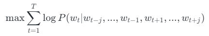
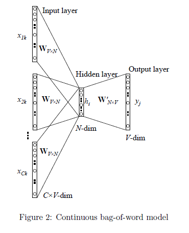
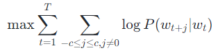
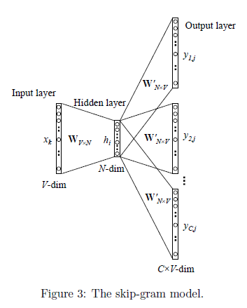
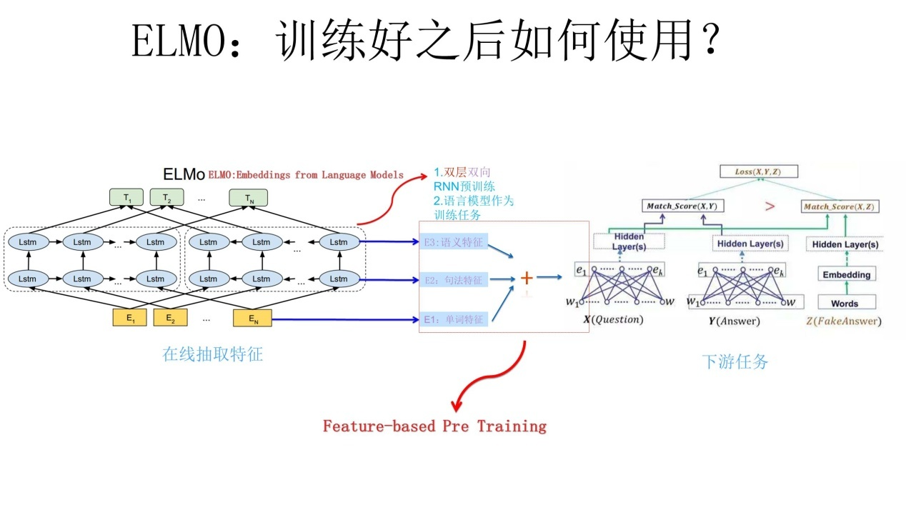
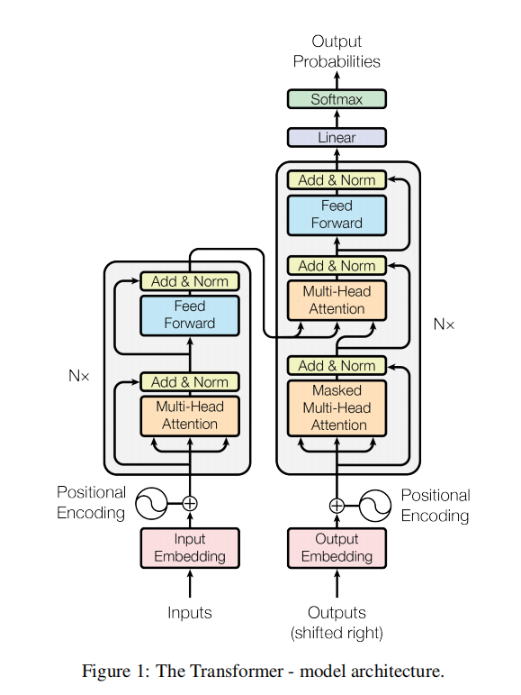
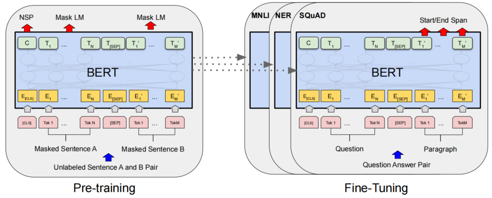

# Task01引言

## 目录

-   [1.1 什么是语言模型](#11-什么是语言模型)
-   [1.2 语言模型进化史](#12-语言模型进化史)
    -   [信息论、熵](#信息论熵)
    -   [N-gram语言模型](#N-gram语言模型)
    -   [Word2Vec](#Word2Vec)
    -   [ELMo](#ELMo)
    -   [Transformer](#Transformer)
    -   [Bert](#Bert)
-   [1.3 大语言模型](#13-大语言模型)

## 1.1 什么是语言模型

说到大模型，首先介绍语言模型（LM），其经典定义是一种对令牌序列（Token）的概率分布。

$p(x_1,...,x_L)$

语言模型可以做判别任务：例如，如果词汇表为{ate,ball,cheese,mouse,the}，模型应该赋予“mouse the  the cheese ate”非常低的概率，因为这在语法上不正确。

也可以做生成任务，语言模型$p$接受一个序列并返回一个序列。最纯粹方法是从语言模型$p$中以概率$p(x_{1:L})$进行采样。

自回归语言模型就是一个经典的生成模型，允许有效的生成给定提示$x_{1:i}$的补全$x_{i+1:L}$。

## 1.2 语言模型进化史

### 信息论、熵

熵：度量概率分布

$\begin{aligned}H(p)=\sum_xp(x)\log \frac{1}{p(x)}\end{aligned}$

熵的值越小，表明序列的结构性越强。

### N-gram语言模型

在一个N-gram语言模型中，关于$x_i$的预测只依赖于最后的$n-1$个字符$x_{i-(n-1):i-1}$，即：

$p(x_i|x_{1:i-1})=p(x_i|x_{i-(n-1):i-1})$

例如：$p(cheese|the,mouse,ate,the)=p(cheese|ate,the) \ \ \ \  (n=3)$

但是该模型只能捕获局部依赖关系，如果$n$太小，模型将无法捕获长距离的依赖关系；如果$n$太大，统计上无法得到概率的好估计。

### Word2Vec

这是一个神经语言模型，可以计算单词的连续向量表示，用于从巨大的数据集中学习高质量的单词向量。

Word2Vec训练模型本质上是**只具有一个隐含层的神经元网络**，输入是采用**One-hot编码**的词汇表向量，输出也是One-hot编码的词汇表向量。但是根据输入输出的不同，主要分为CBOW和skip-gram模型。

训练完毕后，输入层的每个单词与矩阵W相乘得到的向量的就是我们想要的词向量，也叫做word embedding。对应的每个词的词向量表示便是输入层到隐含层的权重$W_{V\times N}$第 i 行的转置。

CBOW模型通过上下文的内容预测中间的目标词，

Skip-gram通过目标词预测其上下文的词，

Word2Vec也有很大的缺陷，由于词和向量是一对一的关系，所以多义词的问题无法解决；此外，Word2vec是一种静态的方式，虽然通用性强，但是无法针对特定任务做动态优化。

### ELMo

ELMo的模型结构如下：

预训练阶段是基于双层双向LSTM的模型，训练好该网络后，输入一个新的句子，句子中每个单词都能得到对应的**三个Embedding**:**最底层是单词的 Word Embedding，往上走是**第一层双向LSTM中对应单词位置的 Embedding，这层编码单词的**句法信息**更多一些；再往上走是**第二层LSTM中对应单词位置的 Embedding**，这层编码单词的**语义信息**更多一些。

与Word2Vec相比，ELMo主要解决了多义词的问题。在ELMo中，预训练好的模型不再只是向量对应关系，而是一个训练好的模型。使用时，将一句话或一段话输入模型，模型会根据上下文来推断每个词对应的词向量，这样可以结合上下文语境对多义词进行理解。

但仍存在一些缺点：双向LSTM是串行机制，训练速度慢，双向LSTM是对不同层参数采用拼接的方法用于下游任务，特征选择和融合较弱等问题。

### Transformer

Transformer是一种**序列到序列的神经网络架构**，不同于CNN和RNN模型，整个网络结构完全是由Attention机制组成。网络结构如下：

网络结构方面：Transformer是一种**序列到序列**的神经网络框架，其由编码器和解码器两部分组成，

-   编码器

    编码器由多头注意力层，前馈神经网络层，一个残差连接和层归一化组成。通过多头注意力层来计算序列中不同单词之间的关系，例如，在处理一个词时，Attention使模型能够专注于输入中该词密切相关的其他词。
-   解码器

    解码器先是包含一个自注意力层前馈层，由残差连接和层归一化组成，这一部分自注意力层是mask multi-head attention，目的是在解码阶段，防止模型利用未来信息，造成信息泄漏；其次是一个编码器-解码器注意力层，该层可以将输入序列的不同位置的信息集成到解码器的当前位置，提高解码器对输入序列的理解能力，在生成过程中帮助解码器能够更好地理解上下文。

这里讲下为什么采用Attention机制，RNN算法的计算是串行的，只能从左向右或从右向左依次计算，这种机制存在两个问题：

1.  时间片 t 的计算依赖t-1时刻的计算结果，这样限制了模型的并行能力；
2.  顺序计算的过程中信息会丢失，尽管LSTM等门机制的结构一定程度上缓解了长期依赖的问题，但是对于特别长期的依赖现象，LSTM依旧无能为力。

而Attention机制，可以将序列中任意两个位置之间的距离缩小为一个常量，使模型不再具有长程依赖问题；并且基于其自身结构特性，具有更好的并行性。

当然，Transformer模型也有很多缺点，如果输入是一个长文本序列，输入时需要将其截断为几百个字符的固定长度片段，再分别进行编码，这样的话，片段之间没有任何信息交互。所以：

-   Transformer**无法建模超过固定长度的序列**的依赖关系，对**长文本编码效果差**；
-   Transformer将要处理的文本分割成等长片段，这样就导致**上下文碎片化**，就可能导致**重要的上下文信息被分割成多个碎片**；
-   在推理阶段，由于解码器本身的特性，会导致**计算量非常大**。

### Bert

BERT是基于Transformer的双向编码器表示的预训练模型，结构如下：

在Bert框架中，主要包含两部分：预训练和微调

-   预训练

    **预训练过程**中，该模型在不同的预训练任务上对未标记的数据进行训练。Bert模型架构是一个多层双向Transformer编码器，与GPT相比，**Bert是双向自注意机制**，可以更好地编码上下文信息，而**GPT只关注左侧的上下文**。

    Transformer的输入：token embeddings 和 positional embeddings

    Bert模型的输入：token embedding、位置嵌入positional embedding和sentence embedding。

    sentence embedding：添加了一个 **\[SEP]标记**来标记句子的结尾，并添加了一个句子嵌入(每个句子的嵌入是恒定的，但两个句子之间不同)。这使得模型可以很容易地确定一个句子的结尾和另一个句子的开始，并为不同的句子赋予不同的含义。

    为了允许分类任务，作者在输入序列的开头添加了一个 **\[CLS] 标记**，仅在分类时使用。

    

    使用两个无监督的任务对BERT**同时**进行预训练，*Masked Language Model\_和\_Next Sentence Prediction*，

    Task1：**Mask LM**, 简单地**随机屏蔽一些百分比的输入标记**（本文15%）**，然后预测这些掩蔽标记**。我们将这个过程称为“掩码语言模型”（MLM）。虽然这允许我们获得一个双向的预训练模型，但缺点是在预训练和微调之间创建了一个不匹配，因为\[MASK]Token在微调期间不会出现。为了缓解这种情况，关于如何构建MASK-LM的训练样本，BERT采用了如下Trick：

    （1）随机遮盖掉整个输入序列15%的token（不遮盖特殊token，如\<cls>和\<sep>）

    （2）选定好需要遮盖的token后，对这个token的处理方式如下：
    -   80%的概率，将token替换为特殊符号\<MASK>
    -   10%的概率，将token随机替换为vocabulary中的某个token
    -   10%的概率，保持原token不变
        **为什么要以一定的概率去改造token，而不是统一给这些选中被遮盖的token一个\<mask>标记呢？**
    这是因为，一来，在之后的**fine-tuning阶段**，数据集中**不会出现这些人造的\<mask>标记**，这就造成预训练的数据集和fine-tuning的数据集不匹配的情况。二来，通过将token进行随机替换，给模型增加噪声，使得模型的泛化能力更强。

    Task2：**Next Sentence Prediction，许多重要的下游任务，如问答（QA）和自然语言推理（NLI），都是基于对两个句子之间的关系的理解，而这并不是由语言建模直接捕获的。为了训练一个**能够理解句子关系的模型，预测输入的两个句子是否是真实相连的两个句子（二元分类）。而此处的embedding，就是要抽取出和此分类相关的足够多的信息。具体步骤如下：

    （1）对输入的句子对进行随机替换
    -   50%的概率，两个句子真实相连
    -   50%的概率，第二个句子是从训练数据集中随机挑选的句子
        （2）将过BERT层抽出的 embedding送入Next Sentence Prediction Model，这也是一个简单的Linear nn。
-   Fine-tuning

    微调过程，首先使用预先训练好的参数初始化BERT模型，并使用从下游任务中获得的标记数据对所有参数进行微调。每个下游任务都有单独的微调模型，即使它们是用相同的预训练参数初始化。对于每个任务，我们只需将特定于任务的输入和输出插入BERT，并端到端调整所有参数。在输入时，预训练中的句子A和句子B类似于(1)释义中的句子对，(2)隐含中的假设-前提对，(3)问答中的问题-段落对，以及(4)文本分类或序列标记中的退化text-∅对。在输出时，令牌表示被输入输出层用于标记级任务，如序列标记或问题回答，\[CLS]表示被输入输出层进行分类，如隐含或情绪分析。

## 1.3 大语言模型

再说到现在流行的大语言模型，通常由数十亿甚至更多参数的神经网络组成，使用自监督学习或半监督学习对大量未标记文本进行预训练，通过改变不同的prompt用于各种各样下游任务。该模型的原理先不在这里介绍，这里主要介绍大语言模型当下存在的风险。

对于该模型，质疑的地方也有很多，主要有以下几点 ：

-   可靠性：对于大模型生成内容的可靠性存在质疑；
-   社会偏见：在不同人群之间存在性能差异；
-   有害性：大模型是根据大量互联网数据进行训练的，自然不可避免地包含了冒犯性内容；
-   虚假信息：现在已经可以看到GPT-3可以轻松制造虚假的新闻文章；
-   安全性：⼤型语⾔模型目前是基于公共互联⽹的抓取进⾏训练的，这意味着任何⼈都可以建⽴⼀个可能进⼊训练数据的网站。从安全⻆度来看，这是⼀个巨⼤的安全漏洞；
-   法律考虑：大模型的训练数据中也有很多版权数据，对于模型生成内容的版权性争议很大；
-   成本和环境影响：大模型在预训练的过程中成本非常昂贵，通常需要数千个GPU并行化处理。对模型的推理也是一个持续性的成本，最终产生的碳排放对环境影响不可估计。
