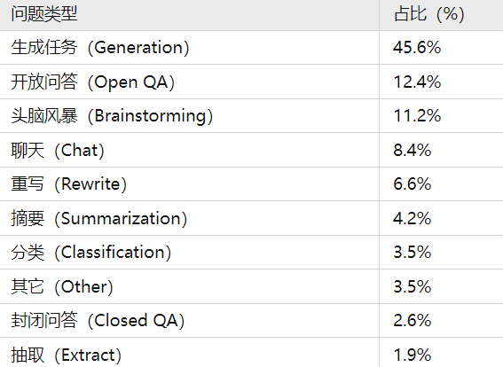
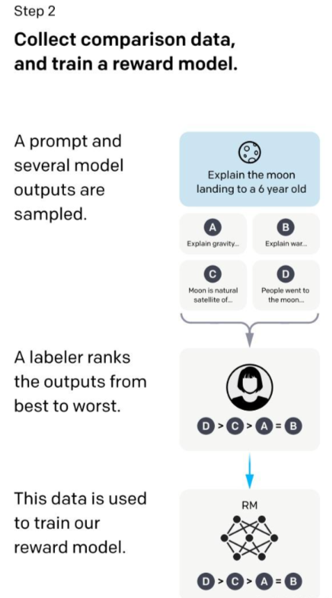
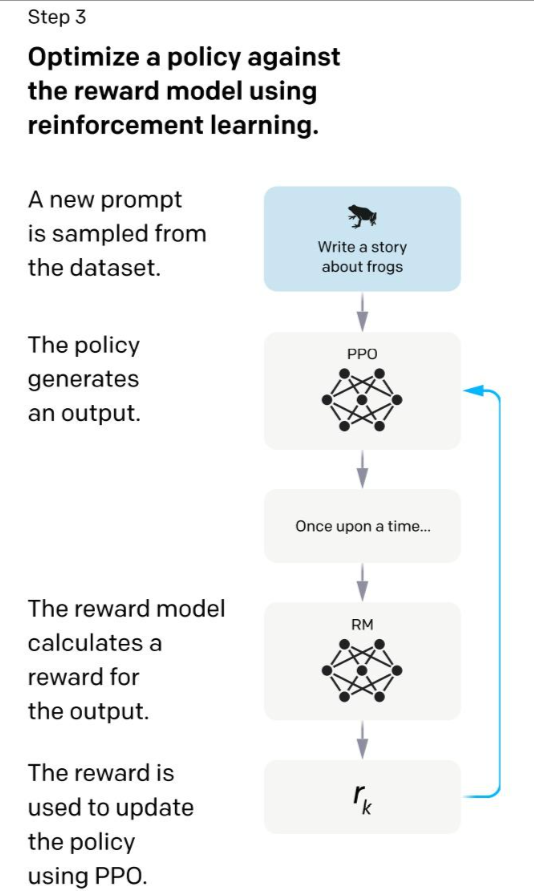

# Task03 ChatGPT技术原理

## 目录

-   [阶段一：有监督微调Supervised fine-tuning (SFT)](#阶段一有监督微调Supervised-fine-tuning-SFT)
-   [阶段二：训练回报模型（Reward Model, RM）](#阶段二训练回报模型Reward-Model-RM)
-   [阶段三：使用强化学习微调 SFT 模型](#阶段三使用强化学习微调-SFT-模型)

ChatGPT 是由 GPT-3 迭代来的，原有的 GPT-3 可能难以从文本中学会一些**更高层次的表示**，这就导致了 GPT-3 这样的语言模型，**很难理解用户的真实意图，经常出现答非所问的情况，一本正经的胡说八道**。

ChatGPT 又是如何做的改进？ChatGPT要解决的核心问题就是怎么让模型和用户对齐。

那么模型和用户对齐是什么呢？就是让模型学会理解人类的命令指令的含义（比如给我写一段小作文生成类问题、知识回答类问题、头脑风暴类问题等不同类型的命令），以及让模型学会判断对于给定 prompt 输入指令（用户的问题），什么样的答案是优质的（富含信息、内容丰富、对用户有帮助、无害、不包含歧视信息等多种标准）。

在这里ChatGPT做的改进是通过引入“人工标注数据+强化学习”（RLHF，Reinforcement Learning from Human Feedback ，这里的人工反馈其实就是人工标注数据）来不断Fine-tune预训练语言模型。

在“人工标注数据+强化学习”框架下，训练 ChatGPT 主要分为三个阶段：

-   第一阶段使用标准数据（prompt 和对应的回答）进行微调，也就是有监督微调 SFT（Supervised fine-tuning）
-   第二个阶段，训练回报模型（Reward Model, RM）。给定 prompt（大约3万左右），使用微调后的模型生成多个回答，人工对多个答案进行排序，然后使用 pair-wise learning 来训练 RM，也就是学习人工标注的顺序（人工对模型输出的多个答案按优劣进行排序）。
-   最后一个阶段就是使用强化学习，微调预训练语言模型。

使用强化学习的目的是让模型的答案更接近人类意图，这一阶段不需要人工标注数据，而是利用上一阶段学好的RM模型，靠RM模型的打分结果来更新预训练模型参数。那么这里又有一个问题，为什么不直接使用SFT，主要原因还是标注数据太少。

下面来详细介绍这三个阶段：

## 阶段一：有监督微调Supervised fine-tuning (SFT)

为了让 ChatGPT 初步具备理解指令中（prompt）蕴含的意图，首先会从测试用户提交的 prompt (就是指令或问题)中随机抽取一批，靠专业的标注人员，给出指定 prompt 的高质量答案，然后用这些人工标注好的\<prompt, answer> 数据来 Fine-tune GPT-3 模型。经过这个过程，我们可以认为 ChatGPT 初步具备了理解人类 prompt 中所包含意图，并根据这个意图给出相对高质量回答的能力，但是由于样本太少，很难达到理想效果。

总的来说，第一阶段主要做的工作是使用人工标注的指令答案数据对来微调GPT3，这一部分就认为ChatGPT初步具备理解prompt中的人类意图。

标注数据集主要是一些问答、生成任务等问题，主要分为如下部分：

## 阶段二：训练回报模型（Reward Model, RM）

这个阶段的主要目的是通过人工标注训练数据，来训练回报模型。具体而言，随机抽样一批用户提交的 prompt (大部分和第一阶段的相同)，使用第一阶段 Fine-tune 好的模型，对于每个 prompt，由之前的 SFT 模型生成 K 个不同的回答，于是模型产生出了\<prompt, answer1>, \<prompt, answer2>….\<prompt, answerK>数据（这里面 K 是4到9之间）。之后，标注人员对 K 个结果按照很多标准（上面提到的相关性、富含信息性、有害信息等诸多标准）综合考虑进行排序，给出 K 个结果的排名顺序，这就是此阶段人工标注的数据。

接下来，我们准备利用这个排序结果数据来训练回报模型，采取的训练模式其实就是平常经常用到的 pair-wise learning to rank（配对学习排序）。对于K个排序结果，两两组合，形成$\binom{k}{2}$个训练数据对，ChatGPT 采取 pair-wise loss 来训练回报模型。RM 模型接受一个输入\<prompt, answer>，给出评价回答质量高低的回报分数 Score。对于一对训练数据\<answer1, answer2>，我们假设人工排序中 answer1 排在 answer2 前面，那么 Loss 函数则鼓励 RM 模型对\<prompt, answer1> 的打分要比 \<prompt, answer2> 的打分要高。

下面是回报模型的损失函数：

$\text{loss}\left( \theta \right)=-\frac{1}{\binom{k}{2}}E_{\left( x,y_w,y_l \right)\sim D}\left[ \text{log}\left( \sigma\left( r_{\theta}\left( x,y_w \right)-r_{\theta}\left( x,y_l \right) \right) \right) \right]$

其中$  r_{\theta}\left( x,y \right)  $表示回报模型的输出，$x$是给定的 prompt，$y$表示对于的回答。$y_w$和$y_l$表示回答$w$排在回答$l$前面 ，类似上面的 answer1 排在 answer2 前面。

总结的来说，在这个阶段里，首先由 SFT 监督模型为每个 prompt 产生 K 个结果，人工根据结果质量由高到低排序，以此作为训练数据，通过 pair-wise learning to rank 模式来训练回报模型。对于学好的 RM 模型来说，输入\<prompt, answer>，输出结果的质量得分，得分越高说明产生的回答质量越高。

## 阶段三：使用强化学习微调 SFT 模型

本阶段无需人工标注数据，而是利用上一阶段学好的 RM 模型，靠 RM 打分结果来更新预训练模型参数。具体而言，首先，从用户提交的 prompt 里随机采样一批新的命令（指的是和第一第二阶段不同的新的 prompt），且由一阶段的 SFT 模型来初始化 PPO 模型的参数。然后，对于随机抽取的 prompt，使用 PPO 模型生成回答answer， 并用上一阶段训练好的 RM 模型给出 answer 质量评估的回报分数 score，这个回报分数就是 RM 赋予给整个回答的整体 reward。

强化学习的目标函数如下：

$\text{object}\left( \phi \right)=E_{\left( x,y\right)\sim D_{\pi {\phi}^{RL}}}\left[ r{\theta}\left( x,y \right)-\beta\space \text{log}\left( \pi {\phi}^{RL}\left( y|x \right)/\pi^{SFT}\left( y|x \right) \right) \right]+\gamma E{x\sim D_{\text{pretrain}}}\left[ \text{log}\left( \pi _{\phi}^{RL}\left( x \right) \right) \right]$

这里面第一项是最大化回报 score，第二项是让强化学习的输出不要偏离 SFT 太多，最后一项是保证微调的同时，原有语言模型的效果不会变差。
