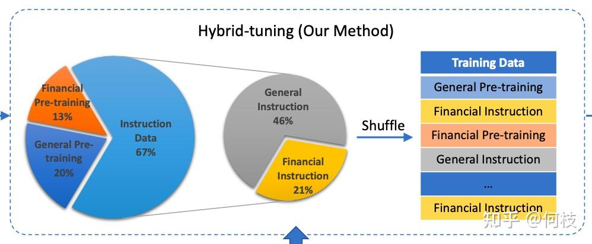
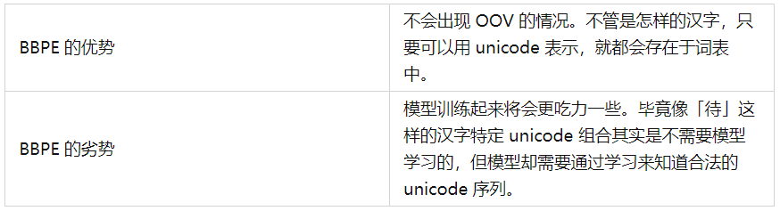
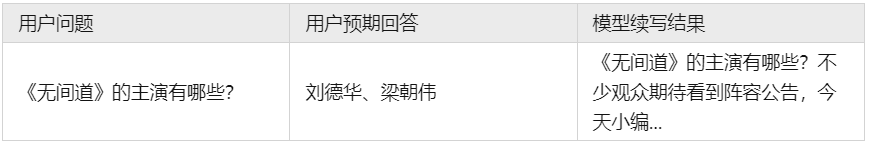
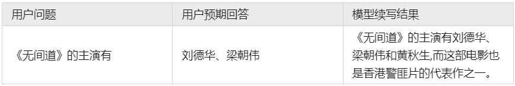

# Task05 从零开始训练大模型

## 目录

-   [1. 预训练阶段](#1-预训练阶段)
    -   [1.1 Tokenizer Training](#11-Tokenizer-Training)
    -   [1.2 Language Model PreTraining](#12-Language-Model-PreTraining)
    -   [1.3 数据集清理](#13-数据集清理)
    -   [1.4 模型效果评测](#14-模型效果评测)
-   [2. 指令微调阶段（Instruction Tuning Stage）](#2-指令微调阶段Instruction-Tuning-Stage)
    -   [2.1 Self Instruction](#21-Self-Instruction)
    -   [2.2 开源数据集整理](#22-开源数据集整理)
    -   [2.3 模型的评测方法](#23-模型的评测方法)
-   [3. 奖励模型（Reward Model）](#3-奖励模型Reward-Model)
    -   [3.1 奖励模型（Reward Model）的必要性](#31-奖励模型Reward-Model的必要性)
    -   [3.2 利用偏序对训练奖励模型](#32-利用偏序对训练奖励模型)
    -   [3.3 使用多少数据能够训练好一个RM？](#33-使用多少数据能够训练好一个RM)
    -   [3.4 RM 模型的大小限制？](#34-RM-模型的大小限制)

前面讲述了ChatGPT的原理，这一节内容就来整理一下如何从零开始训练。

## 1. 预训练阶段

之前的很多工作都选择在一个较强的基座模型上进行微调，并且效果不错，但是这种方法成功的前提是：预训练模型和下游任务的差距不大，预训练模型中通常已经包含微调任务中所需要的知识。

但实际应用过程中，通常会遇到一些问题：

1.  语言不匹配：大多数开源基座对中文的支持都不太友好，例如：\[Llama]、\[mpt]、\[falcon] 等，这些模型在英文上效果都很优秀，但在中文上却差强人意。
2.  **专业知识不足：** 当我们需要一个专业领域的 LLM 时，预训练模型中的知识就尤为重要。由于大多数预训练模型都是在通用训练语料上进行学习，对于一些特殊领域（金融、法律等）中的概念和名词无法具备很好的理解。我们通常需要在训练语料中加入一些领域数据，以帮助模型在指定领域内获得更好的效果。

    

在进行监督微调之前，先看预训练部分。

### 1.1 Tokenizer Training

在进行预训练之前，我们需要先选择一个预训练的模型基座。

一个较为普遍的问题是：大部分优秀的语言模型都没有进行充分的中文预训练，

因此，许多工作都尝试将在英语上表现比较优秀的模型用中文语料进行二次预训练，期望其能够将英语上的优秀能力迁移到中文任务中来。

> 已经有许多优秀的仓库做过这件事情，比如：\[[Chinese-LLaMA-Alpaca](https://link.zhihu.com/?target=https://github.com/ymcui/Chinese-LLaMA-Alpaca "Chinese-LLaMA-Alpaca")]。

但在进行正式的训练之前，我们还有一步很重要的事情去做：词表扩充。

通俗来讲，tokenizer 的目的就是将一句话进行切词，并将切好词的列表喂给模型进行训练。

例如：

> 输入句子 >>> 你好世界
>
> 切词结果 >>> \['你', '好', '世', '界']

通常，tokenizer 有 2 种常用形式：WordPiece 和 BPE。

-   **WordPiece**

    WordPiece 很好理解，就是**将所有的「常用字」和「常用词」都存到词表**中，

    当需要切词的时候就从词表里面查找即可

    
    > 上述图片来自可视化工具 \[[tokenizer\_viewer](https://link.zhihu.com/?target=https://github.com/HarderThenHarder/transformers_tasks/blob/main/tools/tokenizer_viewer/readme.md "tokenizer_viewer")]。
    > 如上图所示，大名鼎鼎的 BERT 就使用的这种切词法。
    当我们输入句子：你好世界，

    BERT 就会依次查找词表中对应的字，并将句子切成词的组合。

    

    当遇到词表中不存在的字词时，tokenizer 会将其标记为特殊的字符 \[UNK]：

    
-   **Byte-level BPE（BBPE）**
    > 有关 BBPE 的原理可以参考 \[[这里](https://zhuanlan.zhihu.com/p/146114164 "这里")]。
    > WordPiece 的方式很有效，但当字词数目过于庞大时这个方式就有点难以实现了。
    对于一些多语言模型来讲，要想穷举所有语言中的常用词（穷举不全会造成 OOV），

    既费人力又费词表大小，为此，人们引入另一种方法：BBPE。

    BPE 不是按照中文字词为最小单位，而是**按照 unicode 编码 作为最小粒度**。

    对于中文来讲，一个汉字是由 3 个 unicode 编码组成的，

    因为平时我们不会拆开来看（毕竟中文汉字是不可拆分的），所以我一开始对这个概念也不太熟悉。

    我们来看看 LLaMA 的 tokenizer 对中文是如何进行 encode 的：

    
    > 上述图片来自可视化工具 \[[tokenizer\_viewer](https://link.zhihu.com/?target=https://github.com/HarderThenHarder/transformers_tasks/blob/main/tools/tokenizer_viewer/readme.md "tokenizer_viewer")]。
    > 可以看到，「编码」两个字能够被正常切成 2 个字，
    但「待」却被切成了 3 个 token，这里的每个 token 就是 1 个 unicode 编码。

    

    通过 token 查找功能，我们可以发现「编」「码」在词表中，但「待」不在词表中。

    但任何 1 个汉字都是可以由 unicode 表示（只是组合顺序不同），因此「待」就被切成了 3 个 token。

    

    通常在模型训练不够充足的时候，模型会输出一些乱码（不合法的 unicode 序列）：
    > 例：游泳池是杭州西湖的一个游泳池，���
-   **词表扩充**

    为了降低模型的训练难度，人们通常会考虑在原来的词表上进行「词表扩充」，

    也就是将一些常见的汉字 token 手动添加到原来的 tokenizer 中，从而降低模型的训练难度。

    我们对比 \[[Chinese-LLaMA](https://link.zhihu.com/?target=https://github.com/ymcui/Chinese-LLaMA-Alpaca "Chinese-LLaMA")] 和 \[[LLaMA](https://link.zhihu.com/?target=https://huggingface.co/decapoda-research/llama-7b-hf "LLaMA")] 之间的 tokenizer 的区别：

    

    我们可以发现：Chinese LLaMA 在原始 tokenizer 上新增了17953 个 tokens，且加入 token 的大部分为汉字。

    而在 \[[BELLE](https://link.zhihu.com/?target=https://arxiv.org/pdf/2304.07854.pdf "BELLE")] 中也有同样的做法：

    在 120w 行中文文本上训练出一个 5w 规模的 token 集合，

    并将这部分 token 集合与原来的 LLaMA 词表做合并，

    最后再在 3.2B 的中文语料上对这部分新扩展的 token embedding 做二次预训练。

    

### 1.2 Language Model PreTraining

在扩充完 tokenizer 后，我们就可以开始正式进行模型的预训练步骤了。

Pretraining 的思路很简单，就是输入一堆文本，让模型做 Next Token Prediction 的任务，这个很好理解。

我们主要来讨论几种预训练过程中所用到的方法：数据源采样、数据预处理、模型结构。

-   **数据源采样**

    在 \[[gpt3](https://link.zhihu.com/?target=https://arxiv.org/pdf/2005.14165.pdf "gpt3")] 的训练过程中，存在多个训练数据源，论文中提到：对不同的数据源会选择不同采样比例：

    

    通过「数据源」采样的方式，能够缓解模型在训练的时候受到「数据集规模大小」的影响。

    从上图中可以看到，相对较大的数据集（Common Crawl）会使用相对较大的采样比例（60%），

    这个比例远远小于该数据集在整体数据集中所占的规模（410 / 499 = 82.1%），

    因此，CC 数据集最终实际上只被训练了 0.44（0.6 / 0.82 \* (300 / 499））个 epoch。

    而对于规模比较小的数据集（Wikipedia），则将多被训练几次（3.4 个 epoch）。

    这样一来就能使得模型不会太偏向于规模较大的数据集，从而失去对规模小但作用大的数据集上的学习信息。
-   **数据预处理**

    数据预处理主要指如何将「文档」进行向量化。

    通常来讲，在 Finetune 任务中，我们通常会直接使用 truncation 将超过阈值（2048）的文本给截断，

    但在 Pretrain 任务中，这种方式显得有些浪费。

    以书籍数据为例，一本书的内容肯定远远多余 2048 个 token，但如果采用头部截断的方式，

    则每本书永远只能够学习到开头的 2048 tokens 的内容（连序章都不一定能看完）。

    因此，最好的方式是将长文章按照 seq\_len（2048）作分割，将切割后的向量喂给模型做训练。
-   **模型结构**

    为了加快模型的训练速度，通常会在 decoder 模型中加入一些 tricks 来缩短模型训练周期。

    目前大部分加速 tricks 都集中在 Attention 计算上（如：MQA 和 Flash Attention \[[falcon](https://link.zhihu.com/?target=https://huggingface.co/tiiuae/falcon-40b "falcon")] 等）；

    此外，为了让模型能够在不同长度的样本上都具备较好的推理能力，

    通常也会在 Position Embedding 上进行些处理，选用 ALiBi（\[[Bloom](https://link.zhihu.com/?target=https://huggingface.co/bigscience/bloom-7b1 "Bloom")]）或 RoPE（\[[GLM-130B](https://link.zhihu.com/?target=https://huggingface.co/spaces/THUDM/GLM-130B "GLM-130B")]）等。
-   **Warmup & Learning Ratio 设置**

    在继续预训练中，我们通常会使用 warmup 策略，此时我们按照 2 种不同情况划分：
    1.  当训练资源充足时，应尽可能选择较大的学习率以更好的适配下游任务；
    2.  当资源不充足时，更小的学习率和更长的预热步数或许是个更好的选择。

### 1.3 数据集清理

中文预训练数据集可以使用 \[[悟道](https://link.zhihu.com/?target=https://data.baai.ac.cn/details/WuDaoCorporaText "悟道")]，数据集分布如下（主要以百科、博客为主）：


但开源数据集可以用于实验，如果想突破性能，则需要我们自己进行数据集构建。

在 \[[falcon paper](https://link.zhihu.com/?target=https://arxiv.org/pdf/2306.01116.pdf "falcon paper")] 中提到，仅使用「清洗后的互联网数据」就能够让模型比在「精心构建的数据集」上有更好的效果，

一些已有的数据集和它们的处理方法如下：


### 1.4 模型效果评测

关于 Language Modeling 的量化指标，较为普遍的有 \[[PPL](https://zhuanlan.zhihu.com/p/424162193 "PPL")]，\[[BPC](https://zhuanlan.zhihu.com/p/424162193 "BPC")] 等，

可以简单理解为在生成结果和目标文本之间的 Cross Entropy Loss 上做了一些处理。

这种方式可以用来评估模型对「语言模板」的拟合程度，

即给定一段话，预测后面可能出现哪些合法的、通顺的字词。

但仅仅是「生成通顺句子」的能力现在已经很难满足现在人们的需求，

大部分 LLM 都具备生成流畅和通顺语句能力，很难比较哪个好，哪个更好。

**为此，我们需要能够评估另外一个大模型的重要能力 —— 知识蕴含能力**。

-   **C-Eval**

    一个很好的中文知识能力测试数据集是 \[[C-Eval](https://link.zhihu.com/?target=https://github.com/SJTU-LIT/ceval "C-Eval")]，涵盖1.4w 道选择题，共 52 个学科。

    覆盖学科如下：

    

由于是选择题的形式，我们可以通过将题目写进 prompt 中，

并让模型续写 1 个 token，判断这个续写 token 的答案是不是正确答案即可。

但大部分没有精调过的预训练模型可能无法续写出「A B C D」这样的选项答案，

因此，官方推荐使用 5-shot 的方式来让模型知道如何输出答案：

```text
以下是中国关于会计考试的单项选择题，请选出其中的正确答案。

下列关于税法基本原则的表述中，不正确的是____。
A. 税收法定原则包括税收要件法定原则和税务合法性原则
B. 税收公平原则源于法律上的平等性原则
C. 税收效率原则包含经济效率和行政效率两个方面
D. 税务机关按法定程序依法征税，可以自由做出减征、停征或免征税款的决定
答案：D

甲公司是国内一家领先的新媒体、通信及移动增值服务公司，由于遭受世界金融危机，甲公司经济利润严重下滑，经营面临困境，但为了稳定职工队伍，公司并未进行裁员，而是实行高层管理人员减薪措施。甲公司此举采用的收缩战略方式是____。
A. 转向战略
B. 放弃战略
C. 紧缩与集中战略
D. 稳定战略
答案：C

...             # 第 3, 4, 5 道样例题

下列各项中，不能增加企业核心竞争力的是____。
A. 产品差异化
B. 购买生产专利权
C. 创新生产技术
D. 聘用生产外包商
答案：

```

通过前面的样例后，模型能够知道在「答案：」后面应该输出选项字母。

于是，我们获得模型续写后的第一个 token 的概率分布（logits），

并取出「A B C D」这 4 个字母的概率，通过 softmax 进行归一化：

```纯文本
probs = (
    torch.nn.functional.softmax(
        torch.tensor(
            [
                logits[self.tokenizer.encode(
                    "A", bos=False, eos=False)[0]],
                logits[self.tokenizer.encode(
                    "B", bos=False, eos=False)[0]],
                logits[self.tokenizer.encode(
                    "C", bos=False, eos=False)[0]],
                logits[self.tokenizer.encode(
                    "D", bos=False, eos=False)[0]],
            ]
        ),
        dim=0,
    ).detach().cpu().numpy()
)
pred = {0: "A", 1: "B", 2: "C", 3: "D"}[np.argmax(probs)] 

```

C-Eval 通过这种方式测出了许多模型在中文知识上的效果，

由于是 4 选项问题，所以基线（随机选择）的正确率是 25%。

C-Eval 也再一次证明了 GPT-4 是个多么强大的知识模型：


## 2. 指令微调阶段（Instruction Tuning Stage）

在完成第一阶段的预训练后，就可以开始进到指令微调阶段了。

由于预训练任务的本质在于「续写」，而「续写」的方式并一定能够很好的回答用户的问题。

例如：



因为训练大多来自互联网中的数据，我们无法保证数据中只存在存在规范的「一问一答」格式，

这就会造成预训练模型通常无法直接给出人们想要的答案。

但是，这并不代表预训练模型「无知」，只是需要我们用一些巧妙的「技巧」来引导出答案：



不过，这种需要用户精心设计从而去「套」答案的方式，显然没有那么优雅。

既然模型知道这些知识，只是不符合我们人类的对话习惯，那么我们只要再去教会模型「如何对话」就好了。

**这就是 Instruction Tuning 要做的事情，即指令对齐**。

OpenAI 在 \[[instruction-following](https://link.zhihu.com/?target=https://openai.com/research/instruction-following "instruction-following")] 中展示了 GPT-3 和经过指令微调前后模型的区别：


**GPT-3 只是在做续写任务，InstructGPT 则能够回答正确内容**

### 2.1 Self Instruction

既然我们需要去「教会模型说人话」，

那么我们就需要去精心编写各式各样人们在对话中可能询问的问题，以及问题的答案。

在 \[[InstructGPT Paper](https://link.zhihu.com/?target=https://arxiv.org/pdf/2203.02155.pdf "InstructGPT Paper")] 中，使用了 1.3w 的数据来对 GPT-3.5 进行监督学习（下图中左 SFT Data）：


可以观察到，数据集中人工标注（labeler）占大头，

这还仅仅只是 InstructGPT，和 ChatGPT 远远不是一个量级。

可见，使用人工标注是一件成本巨大的事情，

除了找到足够的人数，还需要保持团队中每个人的「专业」且「认知一致」。

如果这件事从头开始做自然很难（OpenAI 确实厉害），但今天我们已经有了 ChatGPT 了，

**我们让 ChatGPT 来教我们自己的模型不就好了吗？**

这就是 Self Instruction 的思路，即**通过 ChatGPT 的输入输出来蒸馏自己的模型**。

一个非常出名的项目是 \[[stanford\_alpaca](https://link.zhihu.com/?target=https://github.com/tatsu-lab/stanford_alpaca "stanford_alpaca")]。

如果从 ChatGPT 「套」数据，那么我们至少需要「套」哪些数据。

Instruction Tuning 中的「输入」（问题）和「输出」（答案）是训练模型的关键，

答案很好得到，喂给 ChatGPT 问题根据返回结果就能获得，

但「问题」从哪里获得呢？

（靠人想太累了，屏幕前的你不妨试试，看看短时间内能想出多少有价值的问题）

Alpaca 则是使用「种子指令（seed）」，使得 ChatGPT 既生成「问题」又生成「答案」。

由于 Alpaca 是英文项目，为了便于理解，我们使用相同思路的中文项目 \[[BELLE](https://link.zhihu.com/?target=https://github.com/LianjiaTech/BELLE "BELLE")] 作为例子。

通俗来讲，就是人为的先给一些「训练数据样例」让 ChatGPT 看，

紧接着利用 ChatGPT 的续写功能，让其不断地**举一反三**出新的训练数据集：

```纯文本
你被要求提供10个多样化的任务指令。这些任务指令将被提供给GPT模型，我们将评估GPT模型完成指令的能力。
以下是你提供指令需要满足的要求：
1.尽量不要在每个指令中重复动词，要最大化指令的多样性。
2.使用指令的语气也应该多样化。例如，将问题与祈使句结合起来。
3.指令类型应该是多样化的，包括各种类型的任务，类别种类例如：brainstorming，open QA，closed QA，rewrite，extract，generation，classification，chat，summarization。
4.GPT语言模型应该能够完成这些指令。例如，不要要求助手创建任何视觉或音频输出。例如，不要要求助手在下午5点叫醒你或设置提醒，因为它无法执行任何操作。例如，指令不应该和音频、视频、图片、链接相关，因为GPT模型无法执行这个操作。
5.指令用中文书写，指令应该是1到2个句子，允许使用祈使句或问句。
6.你应该给指令生成适当的输入，输入字段应包含为指令提供的具体示例，它应该涉及现实数据，不应包含简单的占位符。输入应提供充实的内容，使指令具有挑战性。
7.并非所有指令都需要输入。例如，当指令询问一些常识信息，比如“世界上最高的山峰是什么”，不需要提供具体的上下文。在这种情况下，我们只需在输入字段中放置“<无输入>”。当输入需要提供一些文本素材（例如文章，文章链接）时，就在输入部分直接提供一些样例。当输入需要提供音频、图片、视频或者链接时，则不是满足要求的指令。
8.输出应该是针对指令和输入的恰当回答。 
下面是10个任务指令的列表：
###
1. 指令: 在面试中如何回答这个问题？
1. 输入:当你在车里独处时，你会想些什么？
1. 输出:如果是在晚上，我通常会考虑我今天所取得的进步，如果是在早上，我会思考如何做到最好。我也会尝试练习感恩和活在当下的状态，以避免分心驾驶。
###
2. 指令: 按人口对这些国家进行排名。
2. 输入:巴西，中国，美国，日本，加拿大，澳大利亚
2. 输出:中国，美国，巴西，日本，加拿大，澳大利亚
###
3. 指令:
```

如上述例子所示，我们先给出 2 个样例，并让 ChatGPT 进行续写：


### 2.2 开源数据集整理

在这一章中，我们将梳理一些开源的 Instruction Tuning 的数据集，

除了直接拿来用以外，我们期望通过分析这些已有数据集，从而学习如何构建一个指令数据集。

-   **Alpaca**

    \[[stanford\_alpaca](https://link.zhihu.com/?target=https://github.com/tatsu-lab/stanford_alpaca/blob/main/alpaca_data.json "stanford_alpaca")] 采用上述的 self instruction 的方式采集了 5200 条指令训练数据集。

    数据样例如下：
    ```纯文本
    {
        "instruction": "Arrange the words in the given sentence to form a grammatically correct sentence.",
        "input": "quickly the brown fox jumped",
        "output": "The quick brown fox jumped quickly."
    }
    ```
    其中，instruction 代表要求模型做的任务，input 代表用户输入， output 代表喂给模型的 label。

    Alpaca 覆盖了多种类型的指令，其数据分布如下，：

    
-   **BELLE**

    BELLE 开放了好几种规模的数据集，\[[100万](https://link.zhihu.com/?target=https://huggingface.co/datasets/BelleGroup/train_1M_CN "100万")]、\[[200万](https://link.zhihu.com/?target=https://huggingface.co/datasets/BelleGroup/train_2M_CN "200万")]、\[[350万](https://link.zhihu.com/?target=https://huggingface.co/datasets/BelleGroup/train_3.5M_CN "350万")] 等。

    训练数据集样例如下：
    ```纯文本
    {
        "instruction": "判断给定的文章是否符合语法规则。如果不符合，请提供修改建议。 下面是一篇文章的开头: ‘为了探讨这个主题，本文将提供一系列数据和实例，以证明这一观点。’",
        "input": "",
        "output": "这个开头符合语法规则。"
    }
    ```
    由于数据量很大，我们无法统计出训练数据集中各任务的真实占比，

    但从 \[[1000条评测集](https://link.zhihu.com/?target=https://github.com/LianjiaTech/BELLE/blob/main/eval/eval_set.json "1000条评测集")] 数据分布可以推测出，训练数据集中同样包含：摘要、问答、分类等任务。

    

### 2.3 模型的评测方法

比起预训练（Pretrain）环节里相对明确的评价指标（如PPL、NLL等），

Instruction 环节中的评价指标比较令人头疼。

鉴于语言生成模型的发展速度，BLEU 和 ROUGH 这样的指标已经不再客观。

一种比较流行的方式是像 \[[FastChat](https://link.zhihu.com/?target=https://github.com/lm-sys/FastChat/blob/main/fastchat/eval/table/prompt.jsonl "FastChat")] 中一样，利用 GPT-4 为模型的生成结果打分，

这里也尝试使用同样的 Prompt 对 3 种开源模型：OpenLlama、ChatGLM、BELLE 进行测试。

对于每一个问题，我们先获得 ChatGPT 的回复，以及另外 3 种模型的回复，

接着我们将 「ChatGPT 答案 - 候选模型答案」这样的 pair 喂给 GPT-4 打分（满分为 10 分）。

得到的结果如下：


我们对每个任务单独进行了统计，并在最后一列求得平均值。

GPT-4 会对每一条测试样本的 2 个答案分别进行打分，并给出打分理由：


但是，我们发现，GPT-4 打出的分数和给出理由**并不一定正确**。

如上图所示，GPT-4 为右边模型的答案打出了更高的分数，给出的理由是：

将「最长时期」改为了「最长时期之一」会更准确。

但事实上，Instruction 中明确设定就是「最长时期」，

这种「给高分」的理由其实是不正确的。

此外，我们还发现，仅仅调换句子顺序也会对最后打分结果产生影响，

针对这个问题，我们考虑「调换句子顺序并求和平均」来缓解。

但不管怎么样，GPT-4 给出的分数或许并没有我们想象中的那么靠谱，

为此，我们通过人工的 Review 的方式对每个答案进行了一次回扫，得到的结果和标准如下：

> 再次重申：只是期望指出 GPT-4 打分可能会和实际产生偏差的问题，**这里排名不具备任何权威性**。


我们可以看到，

在 GPT-4 打分的结果中，已经有模型的效果甚至超过了 ChatGPT（分数为 1.02），

但再经过人工 Review 后，ChatGPT 的答案是我们认为更合理一些的。

当然，最近陆陆续续的推出了许多新的评测方法，如：\[[PandaLM](https://link.zhihu.com/?target=https://github.com/WeOpenML/PandaLM "PandaLM")]，

以及许多比较有影响力的评测集，如：\[[C-Eval](https://link.zhihu.com/?target=https://github.com/SJTU-LIT/ceval "C-Eval")]、\[[open\_llm\_leaderboard](https://link.zhihu.com/?target=https://huggingface.co/spaces/HuggingFaceH4/open_llm_leaderboard "open_llm_leaderboard")] 等，

## 3. 奖励模型（Reward Model）

### 3.1 奖励模型（Reward Model）的必要性

其实，当我们在做完 SFT 后，我们大概率已经能得到一个还不错的模型。

但我们回想一下 SFT 的整个过程：

**我们一直都在告诉模型什么是「好」的数据，却没有给出「不好」的数据**。

我们更倾向于 SFT 的目的只是将 Pretrained Model 中的知识给引导出来的一种手段，

而在SFT 数据有限的情况下，我们对模型的「引导能力」就是有限的。

这将导致预训练模型中原先「错误」或「有害」的知识没能在 SFT 数据中被纠正，

从而出现「有害性」或「幻觉」的问题。

为此，一些让模型脱离昂贵标注数据，自我进行迭代的方法被提出，比如：\[[RLHF](https://link.zhihu.com/?target=https://arxiv.org/pdf/2203.02155.pdf "RLHF")]，\[[DPO](https://link.zhihu.com/?target=https://arxiv.org/pdf/2305.18290.pdf "DPO")]，

但无论是 RL 还是 DPO，我们都需要让告知模型什么是「好的数据」，什么是「不好的数据」。

> RL 是直接告诉模型当前样本的（好坏）得分，DPO 是同时给模型一条好的样本和一条坏的样本。

而判断样本数据的「好坏」除了昂贵的人工标注之外，

那就是 Reward Model 大显身手的时候了。

### 3.2 利用偏序对训练奖励模型

在 OpenAI 的 \[[Summarization](https://link.zhihu.com/?target=https://arxiv.org/pdf/2009.01325.pdf "Summarization")] 和 \[[InstructGPT](https://link.zhihu.com/?target=https://arxiv.org/pdf/2203.02155.pdf "InstructGPT")] 的论文中，都使用了「偏序对」来训练模型。

偏序对是指：不直接为每一个样本直接打分，而是标注这些样本的好坏顺序。

模型通过尝试最大化「好句子得分和坏句子得分之间的分差」，从而学会自动给每一个句子判分。

我们可以来做一个简单实验，我们构造一批如下数据：

```纯文本
{
    "prompt": "下面是一条正面的评论：",
    "selected": "屯了一大堆，今年过年的话蛮富足的!到货很快的!",
    "rejected": "对商品谈不上满意，但是你们店的信誉极度不满意，买了件衣服取消了订单，要求退款，结果退款过程进行一半就不进行了，真是因小失大啊"
}
```

其中，prompt 是要求模型续写一条好评，selected 是一条好的回答（A），rejected 是一条不好的回答（B）。

我们使用 \[[llama-2-7b](https://link.zhihu.com/?target=https://huggingface.co/meta-llama/Llama-2-7b "llama-2-7b")] 作为基座模型训练，期望模型对于 A 回答能够给尽可能高的分，B 回答则尽可能低。


将训练过程中的「分差变化」绘制出来，

伴随着 loss 的降低，发现分差的均值和方差都呈上升的趋势：

> Note：这里的分差是指 r(好答案) - r(坏答案) 的分差。


进一步的绘制出在 100 个评测样本的分差分布：

在 step 0（未训练）时，模型打出来的分差是一个近似均值为 0，方差为 0.1 的正态分布，

这说明初始模型无法区分数据的好坏（好数据 - 坏数据的得分有正有负）。

随着模型训练，分布均值从 0 开始逐渐增长，这证明模型开始逐渐让「好数据」 - 「坏数据」的分差越来越大。

到第 60 个 step 之后，分布的均值和方差开始趋于稳定。


至此，已经让 RM 学会了给「正向评论」打分更高，给「负向评论」打分更低。

### 3.3 使用多少数据能够训练好一个RM？

在 OpenAI Summarize 的任务中，使用了 \[[6.4w 条](https://link.zhihu.com/?target=https://github.com/openai/summarize-from-feedback "6.4w 条")] 偏序对进行训练。

在 InstructGPT 任务中，使用了 3.2w 条 \[4\~9] 偏序对进行训练。


在 \[[StackLlama](https://link.zhihu.com/?target=https://huggingface.co/blog/zh/stackllama "StackLlama")] 任务中，使用了 10w 条 \[[Stack Exchange](https://link.zhihu.com/?target=https://stackexchange.com/ "Stack Exchange")] 偏序对进行训练。

从上述工作中，仍无法总结出一个稳定模型需要的最小量级，这取决于具体任务。

但至少看起来，5w 以上的偏序对可能是一个相对保险的量级。

### 3.4 RM 模型的大小限制？

Reward Model 的作用本质是给生成模型的生成内容进行打分，所以 Reward Model 只要能理解生成内容即可。

关于 RM 的规模选择上，目前没有一个明确的限制：

Summarize 使用了 6B 的 RM，6B 的 LM。

InstructGPT 使用了 6B 的 RM，175B 的 LM。

DeepMind 使用了 70B 的 RM，70B LM。

不过，一种直觉的理解是：判分任务要比生成认为简单一些，因此可以用稍小一点的模型来作为 RM。
