# Task 07 Chain-of-Thought大模型思维链

## 目录

-   [背景](#背景)
-   [大模型“涌现”的思维链](#大模型涌现的思维链)
-   [1. 思维链概念的开山之作——Chain-of-Thought Prompting](#1-思维链概念的开山之作Chain-of-Thought-Prompting)
    -   [1.1 CoT-Chain-of-Thought Prompting Elicits Reasoning in Large Language Models](#11-CoT-Chain-of-Thought-Prompting-Elicits-Reasoning-in-Large-Language-Models)
    -   [1.2 技术细节](#12-技术细节)
-   [2. Zero-shot-CoT](#2-Zero-shot-CoT)
-   [3. 多数投票提高CoT性能——自洽性（Self-consistency）](#3-多数投票提高CoT性能自洽性Self-consistency)
-   [4. LtM （Least to Most prompting）提示](#4-LtM-Least-to-Most-prompting提示)
-   [5. Flan-PaLM/T5：CoT + Finetuning](#5-Flan-PaLMT5CoT--Finetuning)
-   [6. 提升小模型的推理能力：Fine-tune-CoT](#6-提升小模型的推理能力Fine-tune-CoT)
-   [7. CoT的局限性](#7-CoT的局限性)

## 背景

2021年，提示学习（prompt learning）浪潮兴起，而早在2020年，OpenAI 就在论文 [Language Models are Few-Shot Learners](https://link.zhihu.com/?target=https://arxiv.org/pdf/2005.14165.pdf "Language Models are Few-Shot Learners") 中提出了如何使用 prompt learning 提升大模型的推理能力。
论文中提出了 Zero-shot、One-shot、Few-shot 三种不同的 prompt 方法，如下图所示。

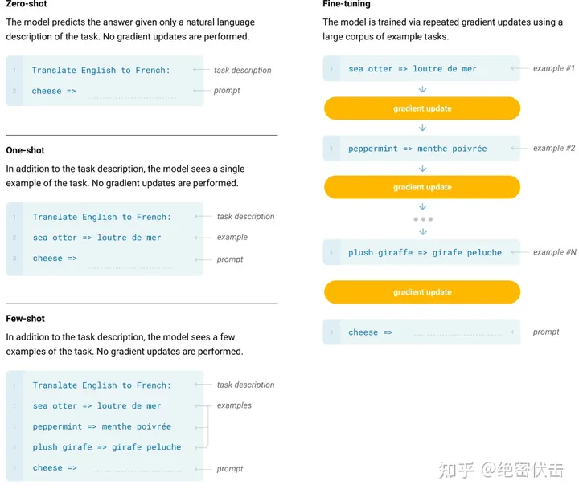

-   **Few-Shot（FS）** 是指模型在推理时给予少量样本，但不允许进行权重更新。对于一个典型数据集，Few-shot 有上下文和样例（例如英语句子和它的法语翻译）。Few-shot 的工作方式是提供 K 个样本，然后期望模型生成对应的结果。通常将 K 设置在 10 到 100 的范围内，因为这是可以适应模型上下文窗口的示例数量（nctx = 2048）。Few-shot 的主要优点是大幅度降低了对特定任务数据的需求，并减少了从微调数据集中学习过度狭窄分布。主要缺点是该方法的结果迄今为止远不如最先进的微调模型。此外，仍需要一小部分特定任务的数据。
-   **One-Shot（1S）** 与 Few-Shot 类似，只允许一个样本（除了任务的自然语言描述外）。将 One-Shot 与 Few-Shot、Zero-Shot 区分开的原因是它最接近某些任务与人类沟通的方式。相比之下，如果没有示例，有时很难传达任务的内容或格式。
-   **Zero-Shot（0S）** 和 One-shot 类似，但不允许提供样本，只给出描述任务的自然语言指令。该方法提供了最大的方便性、稳健性以及避免虚假相关的可能性，但也是最具挑战性的设置。在某些情况下，即使是人类，在没有例子的情况下，也可能难以理解任务的格式。例如，如果要求某人“制作一张关于200米冲刺世界纪录的表格”，这个请求可能是模棱两可的，因为可能不清楚表格应该具有什么格式或包含什么内容。然而，至少在某些情况下，Zero-shot 是最接近人类执行任务的方法，例如图 1 中的翻译示例，人类可能仅凭文本指令就知道该做什么。

但是，即使是 Few-Shot，这种方法还是有比较大的缺陷的。如果你的问题相对简单，不需要什么逻辑推理，可能靠大模型背答案就能做得不错，但是对于一些需要推理的问题，都不用太难，就一些简单的算术应用题，大模型就大概率不太 work。于是，思维链（Chain-of-Thought，CoT）很自然地被提出了。

## 大模型“涌现”的思维链

最近 AI 大厂的开发人员和高校的 NLP 研究人员，都在琢磨，怎么让大模型“涌现”。

所谓“涌现”，在大模型领域指的是当模型突破某个规模时，性能显著提升，表现出让人惊艳、意想不到的能力。比如语言理解能力、生成能力、逻辑推理能力等。一般来说，模型在 100亿（10B） 到 1000亿（100B） 参数区间，可能产生能力涌现。

但只一味把模型做的大大大，也未必能让AI“显灵”。

强大的逻辑推理是大语言模型“智能涌现”出的核心能力之一，好像AI有了人的意识一样。而推理能力的关键，在于一个技术——思维链（Chain of Thought，CoT）。

大家如果看过类 GPT 应用的翻车问题，会发现大多都是数学算术题、逻辑思考题等，这类需要精确推理的问题，而这正是思维链能够重点解决的。现在训练大语言模型的企业和机构很多，但能够训练出思维链并应用的很少。

## 1. 思维链概念的开山之作——Chain-of-Thought Prompting

### 1.1 CoT-[Chain-of-Thought Prompting Elicits Reasoning in Large Language Models](https://link.zhihu.com/?target=https://arxiv.org/abs/2005.14165 "Chain-of-Thought Prompting Elicits Reasoning in Large Language Models")

具体来说，思维链方式有三个特点：

-   **常识推理能力赶超人类**。以前的语言模型，在很多挑战性任务上都达不到人类水平，而采用思维链提示的大语言模型，在 Bench Hard(BBH) 评测基准的 23 个任务中，有 17 个任务的表现都优于人类基线。比如常识推理中会包括对身体和互动的理解，而在运动理解 sports understanding 方面，思维链的表现就超过了运动爱好者（95% vs 84%）。
-   **数学逻辑推理大幅提升**。一般来说，语言模型在算术推理任务上的表现不太好，而应用了思维链之后，大语言模型的逻辑推理能力突飞猛进。MultiArith 和 GSM8K 这两个数据集，测试的是语言模型解决数学问题的能力，而通过思维链提示，PaLM 这个大语言模型比传统提示学习的性能提高了 300%！在 MultiArith 和 GSM8K 上的表现提升巨大，甚至超过了有监督学习的最优表现。这意味着，大语言模型也可以解决那些需要精确的、分步骤计算的复杂数学问题了。
-   **大语言模型更具可解释性，更加可信**。我们知道超大规模的无监督深度学习，打造出来的大模型是一个黑盒，推理决策链不可知，这就会让模型结果变得不够可信。而**思维链将一个逻辑推理问题，分解成了多个步骤，来一步步进行**，这样**生成的结果就有着更加清晰的逻辑链路，提供了一定的可解释性**，让人知道答案是怎么来的。

### 1.2 技术细节

先来看个论文的结果：

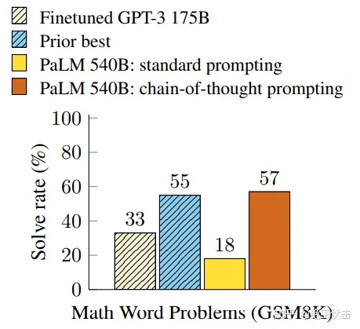

不难看出，在解数学问题上，同样使用 PaLM 这个 540B 的超级 LLM，CoT 的表现是传统 prompting 的300%以上，甚至超过了此前有监督的最优表现。

这看起来很不可思议，然而 CoT 方法却极其简单。CoT 提示过程是一种最近开发的提示方法，它鼓励大语言模型解释其推理过程。思维链的主要思想是通过向大语言模型展示一些少量的 exapmles，在样例中解释推理过程，大语言模型在回答提示时也会显示推理过程。这种推理的解释往往会引导出更准确的结果。

以一个数学题为例：

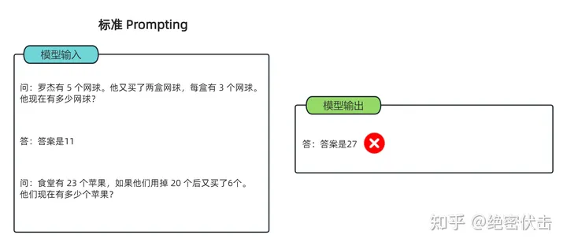

可以看到模型无法做出正确的回答。但如果说，我们给模型一些关于解题的思路，就像我们数学考试，都会把解题过程写出来再最终得出答案，不然无法得分。CoT 做的就是这件事，示例如下：

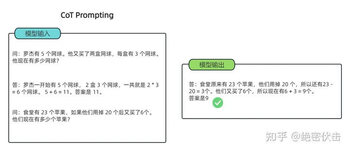

可以看到，类似的算术题，思维链提示会在给出答案之前，还会自动给出推理步骤：

> 📌“罗杰先有5个球，2盒3个网球等于6个，5 + 6 = 11”
> “食堂原来有23个苹果，用了20个，23-20=3；又买了6个苹果，3+6=9”

可以看出，CoT 在实现上修改了 demonstration 每个 example 的 target，source 保留原样，但 target 从原先的 answer(a) 换成了 rationale(r) + a。因此可以看到右侧，所有内容均由模型生成，模型不是生成 a，而是生成r+a。

简单来说，语言模型很难将所有的语义直接转化为一个方程，因为这是一个更加复杂的思考过程，但可以通过中间步骤，来更好地推理问题的每个部分。

思维链提示，就是**把一个多步骤推理问题，分解成很多个中间步骤，分配给更多的计算量，生成更多的 token，再把这些答案拼接在一起进行求解**。

论文里面作者提到了很多 CoT 的优势，其中包括它把一个多步推理问题分解出多个中间步骤，并且让 LLM 更加可解释。它能解决的问题很多，除了上述的数学应用题，还有常识推理、以及 symbolic manipulation （符号操作）这类任务（就是一些手造的考验大模型的问题，比如最典型的 Last Letter Concatenation（最后一个字母串联） 和 coin flip（抛硬币））。

## 2. Zero-shot-CoT

零样本思维链（Zero Shot Chain of Thought，Zero-shot-CoT）提示过程是对 CoT prompting 的后续研究，引入了一种非常简单的零样本提示。研究发现，通过在问题的结尾附加“**Let's think step by step**”这几个词，大语言模型能够生成一个回答问题的思维链。从这个思维链中，他们能够提取更准确的答案。

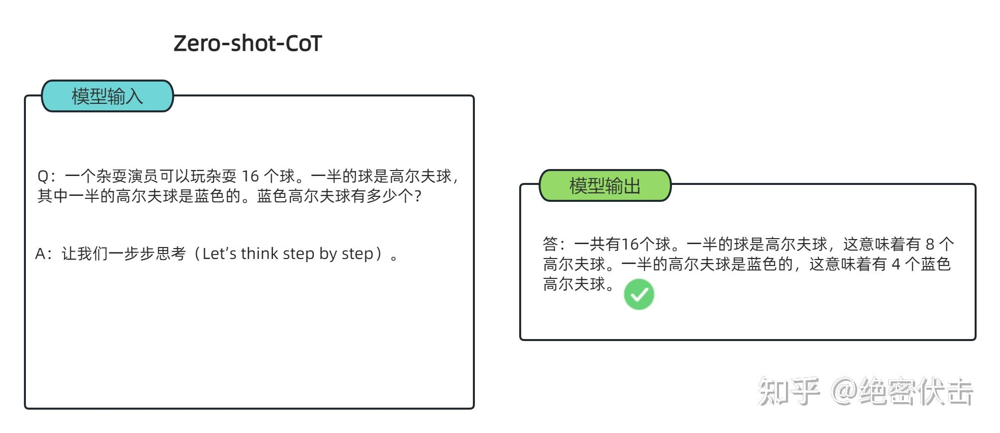

其实 Zero-shot-CoT 是一个 pipeline。也就是说“Let's think step by step”这句话，只是通过这个 prompt 让LLM 尽可能生成一些思考过程，然后再将生成的 rationale（理由） 和 question 拼在一起，重新配合一个answer 指向的 prompt 如“The answer is ”来激励模型生成答案。

从技术上讲，完整的零样本思维链（Zero-shot-CoT）过程涉及两个单独的提示/补全结果。在下图中，左侧生成一个思维链，而右侧接收来自第一个提示（包括第一个提示本身）的输出，并从思维链中提取答案。这个第二个提示是一个**自我增强**的提示。

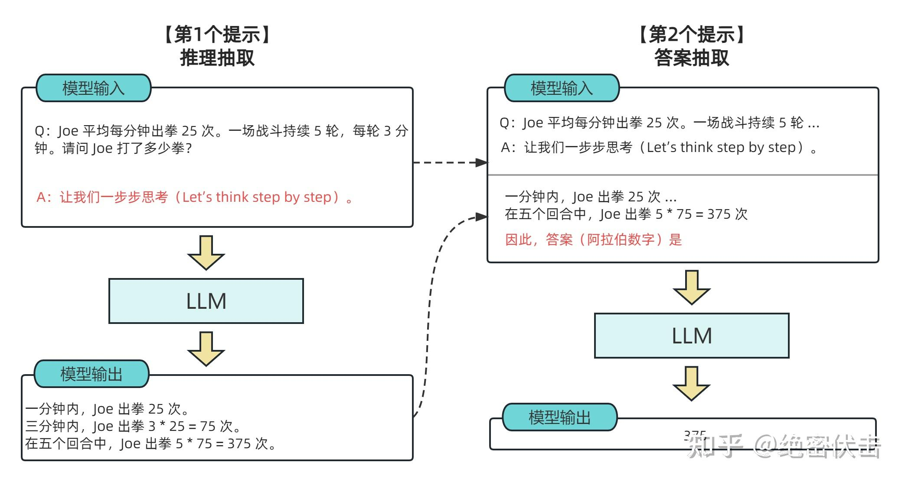

作者还做了解释，说明这句“Let's think step by step”是经过验证的，比如对比下面的其它的 instruction，尤其那些不相关的和误导的，效果就非常差，说明大模型真的是在理解这句 instruction 的意思。

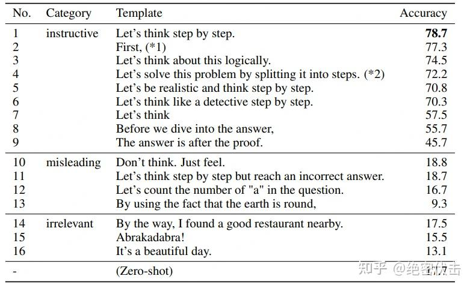

&#x20;Zero-shot-CoT 的实验效果：

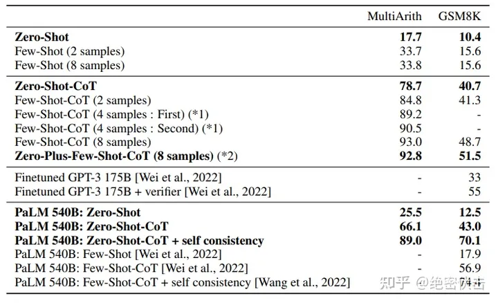

在 GPT-3 上的实验效果：

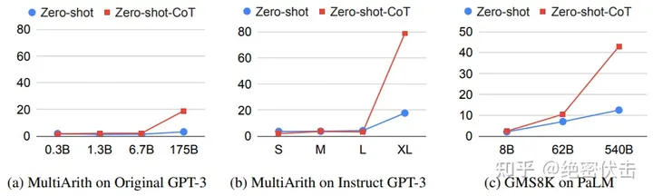

Zero-Shot-CoT 能让 GPT-3 从 17 提升到 78，换到 PaLM 上稍微小点，25 到 66。

## 3. 多数投票提高CoT性能——自洽性（Self-consistency）

论文：Self-Consistency Improves Chain of Thought Reasoning in Language Models.

这篇文章是 CoT 后很快的一个跟进工作，是 CoT 系列改进的重要一步，在 2022 年 3 月在arxiv上被放出来。这篇文章几乎用的和 CoT 完全一样的数据集和设置，主要改进是对答案进行了多数投票（majority vote），并且发现其可以显著地提高思维链方法的性能。

文章提出的方法叫自洽性（Self-consistency），是对 CoT 的一个补充，它不仅仅生成一个思路链，而是生成多个思路链，然后取多数答案作为最终答案。

在下面的图中，左侧的提示是使用少样本思维链范例编写的。使用这个提示，独立生成多个思维链，从每个思维链中提取答案，通过“边缘化推理路径”来计算最终答案。实际上，这意味着取多数答案。

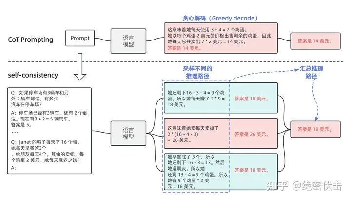

看一下实验效果：

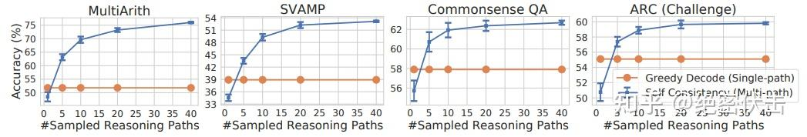

可以看到相比之前的单路径 CoT（图中的Single-path），Self-Consistency 显著提示了效果，而且随着采样个数的提升（图中的 Sampled Reasoning Paths对应图3.1的“采样不同的推理路径”），效果也不断变好。

我们知道 LaMDA-137B 模型中可以通过热度（temperature）和 Top-k 参数控制采样方法，具体的效果如下图所示：

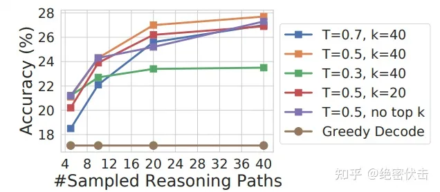

-   热度（temperature）：可以控制语言模型输出的随机度。高热度生成更难预料及富有创造性的结果，低热度则更保守。例如热度为 0.5 时模型生成内容将比 1.0 更容易预测且创造性更少。
-   Top-k：即核心采样（nucleus sampling），是另一个控制语言模型输出随机性的超参数配置。它设定了一个概率阈值，并选择累积概率超过该阈值的最佳词汇，然后模型从这组词汇中随机抽取以生成输出。与传统方法（在整个词汇表中随机抽样）相比，这种方法可以产生更丰富多样且有趣的输出。例如 top-k 为 0.9 时模型将仅考虑概率阈值 90% 以上的词汇。

## 4. LtM （Least to Most prompting）提示

论文：[Least-to-Most Prompting Enables Complex Reasoning in Large Language Models](https://link.zhihu.com/?target=https://arxiv.org/abs/2205.10625 "Least-to-Most Prompting Enables Complex Reasoning in Large Language Models")

最少到最多提示过程 (Least to Most prompting, LtM) 将思维链提示过程 (CoT prompting) 进一步发展，**首先将问题分解为子问题，然后逐个解决**。它是受到针对儿童的现实教育策略的启发而发展出的一种技术。

与思维链提示过程类似，需要解决的问题被分解成一组建立在彼此之上的子问题。在第二步中，这些子问题被逐个解决。**与思维链不同的是，先前子问题的解决方案被输入到提示中，以尝试解决下一个问题**。

简单来说就是一步一步来，step by step。单纯的 CoT 不足以解决复杂问题，但是我们可以把它分解成一个个小问题，然后再使用 CoT，这样模型就能把问题求解出来。所以从这个角度看，Least-to-Most 和 CoT 不是选择关系，而是可以互相打配合的。具体怎么做呢？其实就是两步走，分别是：

-   分解问题
-   解决问题

这么说可能还有些许抽象，下面给一个原文的例子，先看第一阶段：

大多问题都可以定义成“输入-输出”的格式，同样两步走的两个任务也不例外。Stage 1 做的事情就是要求大模型根据输入和提示“To solve {problem}, we need to ”，生成红色的部分，即子问题。换句话说，这个任务的目标就是生成子问题，利用 LLM 和 prompt 去生成。

而 Stage 2 做的事情则是利用 Stage 1 得到的子问题和其解题结果拼进 Stage 2 的输入当中，让模型来生成最终答案，如下图所示：

可以看到图的上半部分即把问题替换成 Stage 1 的子问题，模型就根据 context 和新问题生成子问题的答案。

当然你可能会产生疑问，问题虽然变简单了，但是它可能还是会做错不少，配合后面Stage 2，是不是就错上加错，最后也提升不了多少呢？这时候就可以看到，这一步也是可以用 CoT 来做的，可以看到右上角的框其实把解子问题的解题过程也列出来了。这也是为什么前文提到 Least-to-Most 是可以配合使用的。

下一步做法就是合并：context + 子问题 + 子问题解题过程 + 子问题答案 + 最终问题，然后让模型去生成解题过程和正确答案，那么这一步也是用 CoT 来做的。

显然这是一个两步走的 pipeline，具体不同任务怎么做这个 pipeline 是有些具体细节需要考虑的。

在 SCAN 这个数据集上，Least-to-Most 的表现可以说是让人惊讶，如果使用 GPT-3 的 code-davinci-002，准确率能从 16 提到接近 100%。你甚至可以直接认为这个数据集已经被它直接解决了。

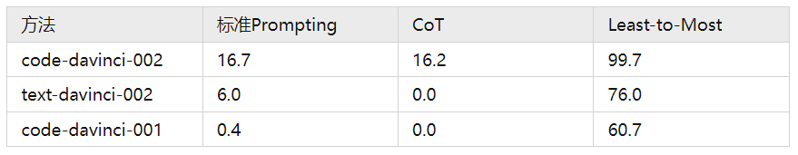

另外还有数学题方面也是在原版 CoT 上很有进一步明显提升：

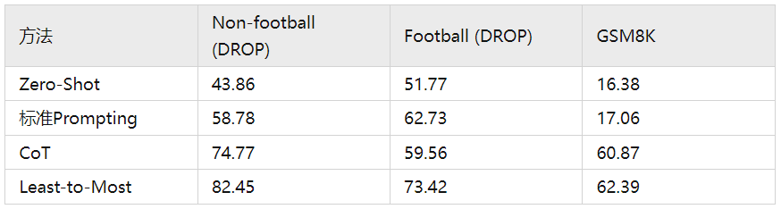

## 5. Flan-PaLM/T5：CoT + Finetuning

> [Scaling Instruction-Finetuned Language Models](https://link.zhihu.com/?target=https://arxiv.org/pdf/2210.11416.pdf "Scaling Instruction-Finetuned Language Models")

Flan-T5 是 Google 最新的一篇工作，通过在超大规模的任务上进行微调，让语言模型具备了极强的泛化性能，做到单个模型就可以在 1800 多个 NLP 任务上都能有很好的表现。这意味着模型一旦训练完毕，可以直接在几乎全部的 NLP 任务上直接使用。

Flan-T5 是在吸收 Flan 的精华的基础上，加入了 CoT 的数据来做 finetune。PaLM/T5 是 2019 年 Google 发布的一个语言模型。论文的核心贡献是提出一套多任务的微调方案，来极大提升语言模型的泛化性。

这么 Finetune 过后的模型，其实不论在 CoT 任务和非 CoT 任务上其实都表现得很好，而且在 BBH 上做zero-shot 优势更是巨大。这也进一步证明了 CoT 是可以和当前流行的 instruction tuning 无缝衔接的。

下面看一下Flan-PaLM/T5的具体做法。

**(1) 任务收集：** 工作的第一步是收集一系列有标签的数据，这里一个任务可以被定义成<数据集，任务类型>的形式，比如“基于 SQuAD 数据集的问题生成任务”。需要注意的是这里有 9 个任务是需要进行推理的任务，即Chain-of-thought （CoT）任务。

**(2) 形式改写：** 因为需要用单个语言模型来完成超过 1800+ 种不同的任务，所以需要将任务都转换成相同的“输入格式”喂给模型训练，同时这些任务的输出也需要是统一的“输出格式”。

如上图所示，根据 “是否需要进行推理 （CoT）” 以及 “是否需要提供示例（Few-shot）” 可将输入输出划分成四种类型：

-   CoT（chain-of-thought） : ❎，few-shot: ❎ （图中左上）
    -   输入：指令 + 问题
    -   输出：答案
-   CoT（chain-of-thought） : ✅，few-shot: ❎ （图中右上）
    -   输入：指令 + CoT 引导（by reasoning step by step） + 问题
    -   输出：推理 + 答案
-   CoT（chain-of-thought）: ❎，few-shot: ✅ （图中左下）
    -   输入：指令 + 示例问题 + 示例问题答案 + 指令 + 问题
    -   输出：答案
-   CoT（chain-of-thought）: ✅，few-shot: ✅（图中右下）
    -   输入：指令 + CoT 引导 + 示例问题 + 示例问题推理 + 示例问题答案 + 指令 + CoT 引导 + 问题
    -   输出：推理 + 答案

**(3) 训练过程**：采用恒定的学习率以及 Adafactor 优化器进行训练；同时会将多个训练样本“打包”成一个训练样本，这些训练样本直接会通过一个特殊的“结束 token”进行分割。训练时候在每个指定的步数会在“保留任务”上进行模型评估，保存最佳的 checkpoint。

尽管微调的任务数量很多，但是相比于语言模型本身的预训练过程，计算量小了非常多，只有 0.2%。所以通过这个方案，大公司训练好的语言模型可以被再次有效的利用，我们只需要做好“微调”即可，不用重复耗费大量计算资源再去训一个语言模型。

一些结论汇总：

-   **微调效果更好**。与不微调相比，通过基于指令的微调可以大幅度提高语言模型的效果
-   **模型越大效果越好**。伴随模型体积的增加， 尤其是指数级的增加，比如从 8B->62B，再从 62B->540B，不论是否微调，效果都有非常显著的提升，而且还没有看到收敛的信号。
-   **任务越多效果越好**。伴随任务数量的增加，模型的性能也会跟着增加，但是当任务数量超过 282 个之后，提升就不是很明显了。因为继续增加新的任务，尤其任务形式跟之前一样，不会给模型带来新的知识；多任务微调的本质是模型能够更好的把从预训练学到的知识进行表达，超过一定任务之后，继续新增相似的任务，知识的表达能力不会继续有很大的收益。进一步统计全部微调数据集的 token 数，发现只占到了预训练数据 token 数的0.2%，这表明还是有很多的知识没有在微调阶段重新被激发。
-   **混杂CoT相关的任务很重要。** 尽管在 1800 多个任务中只有 9 个CoT任务，但是混杂了这 9 个任务之后对整个模型的提升很大。在针对 CoT 相关任务的预测上，如果在微调中混淆 CoT 任务能带来明显的提升；在针对非CoT 相关任务的预测上，如果在微调中混淆了 CoT 任务也不会对模型带来伤害。

总结一下，这篇工作提出了 Flan 的微调框架，核心有四点：

-   统一的输入输出格式（4种类型）
-   引入 CoT （chain-of-thought）
-   大幅提高任务数量
-   大幅提高模型体积

实现了用一个模型来解决超过 1800 种几乎全部的 NLP 任务，通过较低的成本，极大发掘了现有语言模型的泛化性能，让大家看到了通用模型的希望。

## 6. 提升小模型的推理能力：Fine-tune-CoT

> [Large Language Models Are Reasoning Teachers](https://link.zhihu.com/?target=https://arxiv.org/pdf/2212.10071.pdf "Large Language Models Are Reasoning Teachers")

前面已经介绍过，通过包含少数思维链（CoT）推理的样本或通过 promp 来让模型逐步思考的方法可以在大型语言模型中促成复杂的推理能力。

**基于 CoT 方法的主要缺点是它需要依赖于拥有数百亿参数的巨大语言模型**。由于计算要求和推理成本过于庞大，这些模型难以大规模部署。因此，来自韩国科学技术院的研究者努力使小型模型能够进行复杂的推理，以用于实际应用。

有鉴于此，论文提出了一种名为 Fine-tune-CoT 的方法，该方法旨在利用非常大的语言模型的思维链推理能力来指导小模型解决复杂任务。

为了详细说明，下面应用前面的 Zero-shot-CoT从非常大的教师模型中生成推理，并使用它们来微调较小的学生模型。

研究者注意到，与标准的 prompting 类似，对于训练语言模型来解决复杂推理的任务来说，纯微调往往是不够的。虽然已经有人尝试用规定好的推理步骤对小模型进行微调来解决这个问题，但**这些方法需要巨量的推理注释**，而且往往还需要与特定任务匹配的训练设置。

论文中提出的方法，由于基于语言模型的教师具有显著的零样本推理能力，无需手工制作推理注释及特定任务设置，可以很容易地应用于新的下游任务。从本质上讲，论文的方法保留了基于 CoT 的多功能性，同时模型规模还不是很大。

**Fine-tune-CoT 的核心思想是采用 Zero-Shot-CoT 生成我们的问答数据**，然后使用温度 T 采样（也可以用 Top-k 采样），以此生成尽可能多的数据，然后再进行 Fine-tune。

其实就是使用不同的温度参数 T 采样，用 ChatGPT 这样的大模型生成 CoT 数据，然后再用小模型进行 Fine-tune。

在样本研究中，研究者确认多样化推理样本包含各种推理路径以及语言模板，这一点也可以在细化的学生模型中观察到。多样化推理路径被生成并被边缘化以找到最优答案。

> 注释：Top-K采样的解释
> 在机器学习和自然语言处理中，Top-k 采样是一种生成文本或序列的方法。在语言模型中，Top-k 采样通过在概率分布中选择前 k 个最高概率的标记，然后再基于这 k 个标记的分布进行采样。
> 具体来说，给定一个预训练的语言模型，它可以预测下一个可能的标记或单词。在 Top-k 采样过程中，首先计算所有可能的标记的概率，然后将概率按照降序排列。接着，从排在前面的 k 个标记中随机选择一个作为下一个生成的标记，其中 k 是一个用户定义的超参数。通过控制 k 的大小，可以调整生成文本的多样性。较小的 k 值会导致生成的文本较为保守和确定性，而较大的 k 值则会增加文本的多样性和随机性。
> Top-k 采样是一种常用的生成文本的方法，与传统的贪婪采样（选择概率最高的标记）相比，它能够在一定程度上避免生成文本过于重复和单一。

## 7. CoT的局限性

前面说了这么多，是不是有了思维链，大语言模型就所向披靡了呢？照这么发展下去，真能媲美人类的能力了？

大可不必担心，思维链本身还是有很多局限的，而它的局限也是大语言模型的局限。

**首先**，**思维链必须在模型规模足够大时才能涌现**。

在 Jason Wei 等的研究中，PaLM 在扩展到 540B 参数时，与思维链提示结合，才表现出了先进的性能。一些小规模模型，思维链并没有太大的影响，能力提升也不会很大。

谷歌大脑的研究人员认为，策略问题需要大量的世界知识，而小型模型没有足够的参数来记忆这些世界知识，所以也不太可能产生正确的推理步骤。

但问题是，能落地到产业的模型，规模必然不会太大，思维链拆解了更多的步骤、用到更多的计算资源，相当于更加耗费脑力，很多研究机构和企业是负担不起 175B 参数以上的大模型。

所以思维链必须要探索，如何在较小的模型中进行推理，降低实际应用的成本。

**其次**，**思维链的应用领域是有限的**。

目前，思维链只是在一些有限的领域，比如数学问题，五个常识推理基准（CommonsenseQA，StrategyQA，Date Understanding 和 Sports Understanding 以及 SayCan）上显现出作用，其他类型的任务，像是机器翻译，性能提升效果还有待评估。

而且，相关研究用到的模型（GPT-3 API）或数据集，都是半公开或不公开的，这就使其难以被复现和验证。严谨来看，思维链的效果还需要被进一步探索，才能下定论。

**此外，即使有思维链提示，大语言模型依然不能解决小学水平的数学问题**。

没有思维链，数学推理是指定不行。但有了思维链，大语言模型也可能出现错误推理，尤其是非常简单的计算错误。Jason Wei 等的论文中，曾展示过在 GSM8K 的一个子集中，大语言模型出现了 8% 的计算错误，比如6 \* 13 = 68（正确答案是78）。

这说明，即使有了思维链，大语言模型还是没有真正理解数学逻辑，不知道加减乘除的真实意义，只是通过更精细的叠加来“照葫芦画瓢”，所以，对于有精确要求的任务，还要进一步探索新的技术。

思维链确实增强了大语言模型的能力，但逻辑推理仍然是大语言模型的弱项，等待着更多突破。
