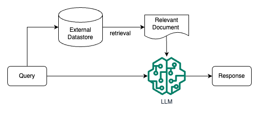
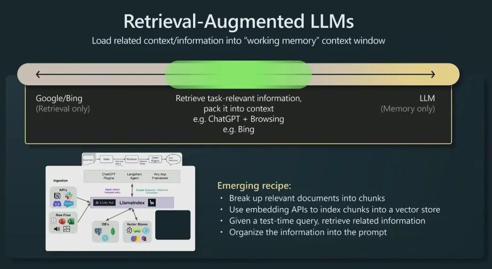
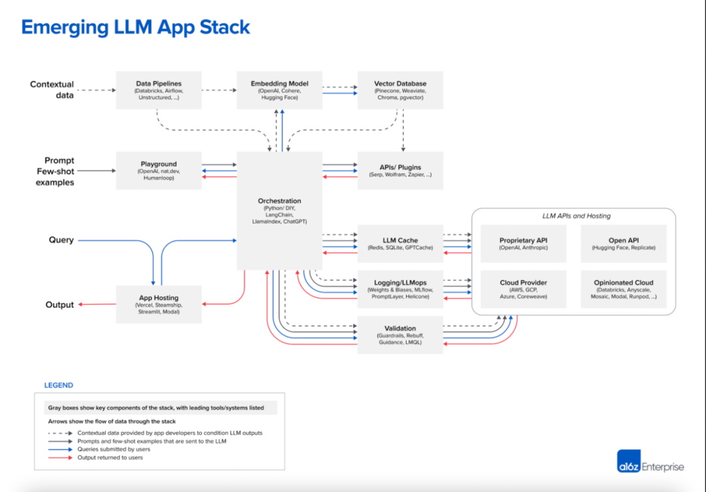

# 08 行业大模型思考\&Retrieval Augmented LLM

## 目录

-   [行业大模型思考](#行业大模型思考)
-   [Retrieval Augmented LLM](#Retrieval-Augmented-LLM)
    -   [01 什么是检索增强 LLM](#01-什么是检索增强-LLM)
    -   [02 检索增强 LLM 解决的问题](#02-检索增强-LLM-解决的问题)
        -   [长尾知识](#长尾知识)
        -   [私有数据](#私有数据)
        -   [数据新鲜度](#数据新鲜度)
        -   [来源验证和可解释性](#来源验证和可解释性)

## 行业大模型思考

行业大模型的定义：**通用大模型**在行业领域的应用，为解决行业问题利用**行业领域数据**训练模型。

行业领域数据，有两类用法，第一类是用行业数据对通用模型进行继续训练、微调等一系列**改变模型权重**的方法；第二类是**不改变**通用大模型的权重，用in context learning的能力通过prompt注入领域知识，或者利用外挂数据库的方式。前者由于改变了模型的权重，可以称作是训练（微调）了一个行业大模型，后者则基本只能认为是通用大模型的应用了，因为模型还是还个模型。

-   大模型解决行业问题的几种做法：
    1.  使用通用数据和领域数据混合，from scratch（从头开始）训练了一个大模型，最典型的代表就是BloombergGPT。
    2.  在一个通用模型的基础上做continue pretraining（继续预训练，二次预训练），像LawGPT就是做了二次预训练的。身边有很多人尝试过这个方案，但普遍反应效果一般（没有SFT来得直接），很有可能是数据配比的问题。
    3.  在一个通用模型的基础上做instruction tuning（SFT），这也是现在开源社区最普遍的做法，有大量的工作比如Huatuo，ChatLaw等等。这种做法的优势是可以快速看到不错的结果，但会发现要提高上限比较困难。
    4.  领域知识库加上通用大模型，针对通用大模型见过的知识比较少的问题，利用向量数据库等方式根据问题在领域知识库中找到相关内容，再利用通用大模型强大的summarization和QA的能力生成回复。
    5.  直接用in context learning的方法，通过构造和领域相关的prompt，由通用大模型直接生成回复。随着业界把context window越做越大，prompt中可以放下越来越多的领域知识，直接用通用大模型也可以对领域问题有很好的回复。

这五种做法里面，1不需要通用大模型作为基础，但需要重新训练一个size和通用大模型相当的模型，2和3都是在通用大模型的基础上或多或少对权重进行了调整，都可以认为是重新训练了一个行业大模型。4和5就只是使用了通用大模型来解决行业问题，很难称之为训练了行业大模型。可见，训练行业大模型是一个variance特别大的事情，可以像1一样几乎重新训练一遍模型，需要几百张卡，也可以像3一样用几百条数据做做SFT，可能几张卡就够了。

## Retrieval Augmented LLM

### 01 什么是检索增强 LLM

检索增强 LLM ( Retrieval Augmented LLM )，简单来说，就是**给 LLM 提供外部数据库**，对于用户问题 ( Query )，通过一些信息检索 ( Information Retrieval, IR ) 的技术，先从外部数据库中检索出和用户问题相关的信息，然后让 LLM 结合这些相关信息来生成结果。这种模式有时候也被称为 检索增强生成 ( Retrieval Augmented Generation, RAG )。 下图是一个检索增强 LLM 的简单示意图。

传统的信息检索工具，比如 Google/Bing 这样的搜索引擎，只有检索能力 ( **Retrieval-only** )，现在 LLM 通过预训练过程，将海量数据和知识嵌入到其巨大的模型参数中，具有记忆能力 ( **Memory-only** )。从这个角度看，检索增强 LLM 处于中间，将 LLM 和传统的信息检索相结合，通过一些信息检索技术将相关信息加载到 LLM 的工作内存 ( **Working Memory** ) 中，即 LLM 的上下文窗口 ( **Context Window** )，亦即 LLM 单次生成时能接受的最大文本输入。

### 02 检索增强 LLM 解决的问题

参考普林斯顿大学陈丹琦小组在 ACL 2023 大会上关于基于检索的语言模型的分享 ACL 2023 Tutorial: Retrieval-based Language Models and Applications。

#### 长尾知识

虽然当前 LLM 的训练数据量已经非常庞大，动辄几百 GB 级别的数据量，万亿级别的标记数量 ( Token )，比如 GPT-3 的预训练数据使用了3000 亿量级的标记，LLaMA 使用了 1.4 万亿量级的标记。训练数据的来源也十分丰富，比如维基百科、书籍、论坛、代码等，LLM 的模型参数量也十分巨大，从几十亿、百亿到千亿量级，但让 LLM 在有限的参数中记住所有知识或者信息是不现实的，训练数据的涵盖范围也是有限的，总会有一些长尾知识在训练数据中不能覆盖到。

对于一些相对通用和大众的知识，LLM 通常能生成比较准确的结果，而对于一些长尾知识，LLM 生成的回复通常并不可靠。ICML 会议上的这篇论文 Large Language Models Struggle to Learn Long-Tail Knowledge，就研究了 LLM 对基于事实的问答的准确性和预训练数据中相关领域文档数量的关系，发现有很强的相关性，即预训练数据中相关文档数量越多，LLM 对事实性问答的回复准确性就越高。从这个研究中可以得出一个简单的结论 —— **LLM 对长尾知识的学习能力比较弱**。下面这张图就是论文中绘制的相关性曲线。

为了提升 LLM 对长尾知识的学习能力，容易想到的是在训练数据加入更多的相关长尾知识，或者增大模型的参数量，虽然这两种方法确实都有一定的效果，上面提到的论文中也有实验数据支撑，但这两种方法是不经济的，即需要一个很大的训练数据量级和模型参数才能大幅度提升 LLM 对长尾知识的回复准确性。而通过检索的方法把相关信息在 LLM 推断时作为上下文 ( Context ) 给出，既能达到一个比较好的回复准确性，也是一种比较经济的方式。下面这张图就是提供相关信息的情况下，不同大小模型的回复准确性，对比上一张图，可以看到对于同一参数量级的模型，在提供少量相关文档参与预训练的情况下，让模型在推断阶段利用相关信息，其回复准确性有了大幅提升。

#### 私有数据

ChatGPT 这类通用的 LLM 预训练阶段利用的大部分都是公开的数据，不包含私有数据，因此对于**一些私有领域知识是欠缺**的。比如问 ChatGPT 某个企业内部相关的知识，ChatGPT 大概率是不知道或者胡编乱造。虽然可以在预训练阶段加入私有数据或者利用私有数据进行微调，但训练和迭代成本很高。此外，有研究和实践表明，通过一些特定的攻击手法，可以让 LLM 泄漏训练数据，如果训练数据中包含一些私有信息，就很可能会发生隐私信息泄露。比如这篇论文 Extracting Training Data from Large Language Models的研究者们就通过构造的 Query 从 **GPT-2** 模型中提取出了个人公开的姓名、邮箱、电话号码和地址信息等，即使这些信息可能只在训练数据中出现一次。文章还发现，较大规模的模型比较小规模的更容易受到攻击。

如果把私有数据作为一个外部数据库，让 LLM 在回答基于私有数据的问题时，直接从外部数据库中检索出相关信息，再结合检索出的相关信息进行回答。这样就不用通过预训练或者微调的方法让 LLM 在参数中记住私有知识，既节省了训练或者微调成本，也一定程度上避免了私有数据的泄露风险。

#### 数据新鲜度

由于 LLM 中学习的知识来自于训练数据，虽然大部分知识的更新周期不会很快，但依然会有一些知识或者信息更新得很频繁。LLM 通过从预训练数据中学到的这部分信息就很容易过时。比如 GPT-4 模型使用的是截止到 2021-09 的预训练数据，因此涉及这个日期之后的事件或者信息，它会拒绝回答或者给出的回复是过时或者不准确的。下面这个示例是问 GPT-4 当前推特的 CEO 是谁，GPT-4 给出的回复还是 Jack Dorsey，并且自己会提醒说回复可能已经过时了。

如果把频繁更新的知识作为外部数据库，供 LLM 在必要的时候进行检索，就可以实现在不重新训练 LLM 的情况下对 LLM 的知识进行更新和拓展，从而解决 LLM 数据新鲜度的问题。

#### 来源验证和可解释性

通常情况下，LLM 生成的输出不会给出其来源，比较难解释为什么会这么生成。而通过给 LLM 提供外部数据源，让其基于检索出的相关信息进行生成，就在生成的结果和信息来源之间建立了关联，因此生成的结果就可以追溯参考来源，可解释性和可控性就大大增强。即可以知道 LLM 是基于什么相关信息来生成的回复。**Bing Chat 就是利用检索来增强 LLM 输出的典型产品**，下图展示的就是 Bing Chat 的产品截图，可以看到其生成的回复中会给出相关信息的链接。

利用检索来增强 LLM 的输出，其中很重要的一步是通过一些检索相关的技术从外部数据中找出相关信息片段，然后把相关信息片段作为上下文供 LLM 在生成回复时参考。有人可能会说，随着 LLM 的上下文窗口 ( **Context Window** ) 越来越长，检索相关信息的步骤是不是就没有必要了，直接在上下文中提供尽可能多的信息。比如 GPT-4 模型当前接收的最大上下文长度是 32K， Claude 模型最大允许 100K 的上下文长度。

虽然 LLM 的上下文窗口越来越大，但检索相关信息的步骤仍然是重要且必要的。一方面当前 LLM 的网络架构决定了其上下文窗口的长度是会有上限的，不会无限增长。另外看似很大的上下文窗口，能容纳的信息其实比较有限，比如 32K 的长度可能仅仅相当于一篇大学毕业论文的长度。另一方面，有研究表明，**提供少量更相关的信息，相比于提供大量不加过滤的信息，LLM 回复的准确性会更高**。比如斯坦福大学的这篇论文 Lost in the Middle就给出了下面的实验结果，可以看到 LLM 回复的准确性随着上下文窗口中提供的文档数量增多而下降。

利用检索技术从大量外部数据中找出与输入问题最相关的信息片段，在为 LLM 生成回复提供参考的同时，也一定程度上过滤掉一些非相关信息的干扰，便于提高生成回复的准确性。此外，**上下文窗口越大，推理成本越高。所以相关信息检索步骤的引入也能降低不必要的推理成本**。
