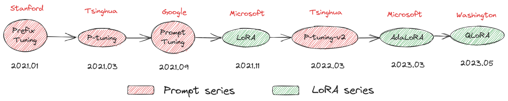
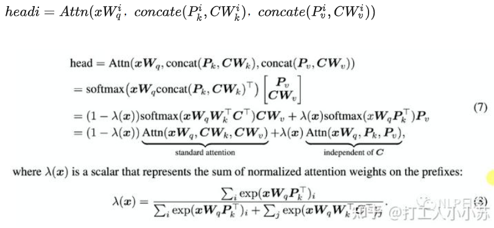

# 10 Prompt参数微调

## 目录

-   [本文围绕PEFT内置七种主流高效调参方法进行原理解析，先介绍相关基本概念，再对其中提到的四种Prompt技术（Prefix Tuning、P-Tuning、Prompt Tuning、P-Tuning v2）从技术背景、原理和特点三个方面进行展开说明。本系列涉及到的七种技术简称和论文标题列表如下](#本文围绕PEFT内置七种主流高效调参方法进行原理解析先介绍相关基本概念再对其中提到的四种Prompt技术Prefix-TuningP-TuningPrompt-TuningP-Tuning-v2从技术背景原理和特点三个方面进行展开说明本系列涉及到的七种技术简称和论文标题列表如下)
-   [基本概念](#基本概念)
-   [Prefix Tuning （2021.01）](#Prefix-Tuning-202101)
-   [P-tuning v1（2021.03）](#P-tuning-v1202103)
-   [Prompt Tuning (2021.09)](#Prompt-Tuning-202109)
-   [P-tuning-v2 (2022.03)](#P-tuning-v2-202203)
-   [LoRA](#LoRA)
-   [AdaLoRA](#AdaLoRA)
-   [QLoRA  ](#QLoRA--)

#### 本文围绕PEFT内置七种主流高效调参方法进行原理解析，先介绍相关基本概念，再对其中提到的四种Prompt技术（Prefix Tuning、P-Tuning、Prompt Tuning、P-Tuning v2）从技术背景、原理和特点三个方面进行展开说明。本系列涉及到的七种技术简称和论文标题列表如下

-   Prefix Tuning: *Prefix-Tuning: Optimizing Continuous Prompts for Generation*,
-   P-Tuning: *GPT Understands, Too*
-   Prompt Tuning: *The Power of Scale for Parameter-Efficient Prompt Tuning*
-   LoRA: *LORA: LOW-RANK ADAPTATION OF LARGE LANGUAGE MODELS*
-   P-Tuning v2: *Prompt Tuning Can Be Comparable to Fine-tuning Universally Across Scales and Tasks*
-   AdaLoRA: *Adaptive Budget Allocation for Parameter-Efficient Fine-Tuning*
-   QLoRA: *QLoRA: Efficient Finetuning of Quantized LLMs*

## 基本概念

**（1）PLM & Fine-tuning & Prompt-Tuning** &#x20;

自从GPT、EMLO、BERT的相继提出，以Pre-training + Fine-tuning 的模式在诸多自然语言处理(NLP)任务中被广泛使用，其先在 Pre-training 阶段通过一个模型在大规模无监督语料上预先训练一个预训练语言模型 (Pre-trained Language Model，PLM)，然后在 Fine-tuning 阶段基于训练好的语言模型在具体的下游任务上再次进行微调(Fine-tuning)，以获得适应下游任务的模型。这种模式在诸多任务的表现上超越了传统的监督学习方法，不论在工业生产、科研创新还是竞赛中均作为新的主流方式。然而，这套模式也存在着一些问题。例如，在大多数的下游任务微调时，下游任务的目标与预训练的目标差距过大导致提升效果不明显，微调过程中依赖大量的监督语料等。至此，以GPT-3、PET（Pattern-Exploiting Training）为首提出一种基于预训练语言模型的新的微调范式一Prompt-Tuning，其旨在通过添加模板的方法来避免引入额外的参数，从而让语言模型可以在小样本 (Few-shot) 或零样本(Zero-shot) 场景下达到理想的效果。Prompt-Tuning又可以称为Prompt、Prompting、Prompt-based Fine-tuning等

**（2）Prompt & Discrete Prompt & Continuous Prompt** &#x20;

Prompt 的功能是组织上下文 x ，目标序列 y ，以及prompt 自己，到一个模板T。例如，在一个预测一个国家的首都的例子中，一个模板T的例子为：“The capital of Britain is \[MASK]”，这里面，“The capital of ... is ...”是prompt，“Britain”是context，以及\[MASK]是目标。

离散的模板构建法 (记Hard Template、Hard Prompt、DiscreteTemplate、Discrete Prompt)，其旨在直接与原始文本拼接显式离散的字符，且在训练中始终保持不变。这里的保持不变是指这些离散字符的词向量 (Word Embedding)在训练过程中保持固定。通常情况下，离散法不需要引入任何参数。

连续的模板构建法 (记Soft Template、 Soft Prompt、 ContinuousTemplate、Continuous Prompt)，其旨在让模型在训练过程中根据具体的上下文语义和任务目标对模板参数进行连续可调。这套方案的动机则是认为离散不变的模板无法参与模型的训练环节，容易陷入局部最优，而如果将模板变为可训练的参数，那么不同的样本都可以在连续的向量空间中寻找合适的伪标记，同时也增加模型的泛化能力。因此，连续法需要引入少量的参数并让模型在训练时进行参数更新。

## **Prefix Tuning （2021.01）**

**技术背景**

首先，在Prefix Tuning之前的工作主要是人工设计离散的模版或者自动化搜索离散的模版。对于人工设计的模版，模版的变化对模型最终的性能特别敏感，加一个词、少一个词或者变动位置都会造成比较大的变化。而对于自动化搜索模版，成本也比较高；同时，以前这种离散化的token搜索出来的结果可能并不是最优的。

其次，传统的微调范式利用预训练模型去对不同的下游任务进行微调，对每个任务都要保存一份微调后的模型权重，一方面微调整个模型耗时长；另一方面也会占很多存储空间。

基于上述两点，Prefix Tuning提出固定预训练LM，为LM添加可训练、任务特定的前缀，这样就可以为不同任务保存不同的前缀，微调成本也小；同时，这种Prefix实际就是连续可微的Virtual Token（Soft Prompt/Continuous Prompt），相比离散的Token，更好优化，效果更好。在实际使用时，挑选任务相关的Prefix和Transformer进行组装，实现可插拔式的应用。

**技术原理**&#x20;

Prefix Tuning在输入token之前构造一段任务相关的virtual tokens作为Prefix，然后训练的时候只更新Prefix部分的参数，而PLM中的其他部分参数固定，Prefix Tuning 针对不同的模型结构构造不同的Prefix。

针对自回归架构模型：在句子前面添加前缀，得到$z = [PREFIX; x; y]$，合适的上文能够在固定 LM 的情况下去引导生成下文。

针对编码器-解码器架构模型：Encoder和Decoder都增加了前缀，得到 z = \[PREFIX; x; PREFIX0; y]。Encoder端增加前缀是为了引导输入部分的编码，Decoder 端增加前缀是为了引导后续token的生成。

**Prefix具体添加到模型的哪部分？**

prefix tuning将prefix参数（可训练的张量）添加到所有的transformer层

机制：将多个prompt vectors 放在每个multi-head attention的key矩阵和value矩阵之前

计算方式：相当于原始的token要多和这些soft prompt token计算相似度，然后聚合。

**技术特点**&#x20;

-   放弃之前人工或半自动离散空间的hard prompt设计，采用连续可微空间soft prompt设计，通过端到端优化学习不同任务对应的prompt参数。

    
-   同等GPT-2模型尺度下，考虑同等量级的优化参数， 多种数据集测试表明，Prefix优于Adapter等微调方式，且与全量微调fine-tuning效果可比肩&#x20;

    
-   prefix-tuning性能优于embedding-only ablation，prefix-tuning是优化所有层的prefix， 而Embedding-only仅优化“virtual tokens”在输入embedding层的参数 ,实验表明，prefix-tuning性能显著好于Embedding-only

    prefix-tuning性能略优于infix-tuning，实验还对比了位置对于生成效果的影响，Prefix-tuning也是要略优于Infix-tuning的。其中，Prefix-tuning形式为 \[PREFIX; x; y]，Infix-tuning形式为 \[x; INFIX; y]，作者认为这是因为Prefix调优可以影响x和y的激活，而Infix调优只能影响y的激活。&#x20;

    

## **P-tuning v1（2021.03）**

**技术背景**&#x20;

大模型的Prompt构造方式严重影响下游任务的效果，比如：GPT-3采用人工构造的模版来做上下文学习（in context learning），但其对人工设计的模版的变化特别敏感，加一个词或者少一个词，或者变动位置都会造成比较大的变化。人工构建prompt模板不仅成本高，鲁棒性差，而且使用的token也是离散的。

如何自动化地寻找连续空间中的知识模板且不用fine-tune语言模型？

**技术原理**&#x20;

P-Tuning通过在连续空间搜索Prompt搭建了GPT和NLU间的桥梁，设计了一种连续可微的virtual token（同Prefix-Tuning类似），该方法将Prompt转换为可以学习的Embedding层，并用MLP+LSTM的方式来对Prompt Embedding进行一层处理（LSTM起到进行Reparamerization加速训练作用），并引入少量自然语言提示的字符（Anchor，例如Britain）进一步提升效果。

相比Prefix Tuning，P-Tuning v1加入的可微的virtual token，但仅限于输入层，没有在每一层都加；另外，virtual token的位置也不一定是前缀，插入的位置是可选的。这里的出发点实际是把传统人工设计模版中的真实token替换成可微的virtual token，在知识探测任务（Knowledge Probing）上，相比人工prompt（离散）方法，P-Tuning v1显著提升效果。

**技术特点**&#x20;

-   与Prefix Tuning一样，P-tuning放弃了“模版由自然语言构成”这一要求，采用Virtual Token构造soft prompt，通过端到端方式在连续空间优化propmt参数，P-tuning应用于NLU
-   通过P-tuning，GPT与Bert在NLU任务上性能相当（甚至超过），证明了之前GPT在NLU方面的能力被低估

    
-   考虑到这些伪标记的相互依赖关系: 认为 \[v1]与\[v2]是有先后关系的，而transformer无法显式地刻画这层关系，因此引入Prompt Encoder，实际过程中采用一层RNN
-   指定上下文词: 如果模板全部是伪标记，在训练时无法很好地控制这些模板朝着与对应句子相似的语义上优化，因此选定部分具有与当前句子语义代表性的一些词作为一些伪标记的初始化 (例如上图中“capital”、“Britain”等)
-   混合提示 (Hydride Prompt) : 将连续提示与离散token进行混合，例如 \[x]\[it]\[v1]\[mask]
-   P-tuning中prompt embedding与 input embedding在人工规则设计下“穿插组合”输入大模型，具体如何“穿插”需要人工考虑的，再者P-tuning使用了自然语言提示的字符，这仍然需要人工设计，并不是完全自动化的。

## **Prompt Tuning (2021.09)**

**技术背景**&#x20;

最近有人提出了几种自动化提示设计的方法，例如Shin等人(2020)提出了一种基于下游应用训练数据指导的单词离散空间搜索算法。虽然这种技术优于手动提示设计，但与模型在连续空间自动调优搜索相比仍有差距。

**技术原理**&#x20;

Prompt Tuning 固定整个预训练模型参数，只允许将每个下游任务的额外 k个可更新的 tokens 前置到输入文本中，也没有使用额外的编码层或任务特定的输出层，对于超过10亿个参数的模型，只需要不到0.01%的特定于任务的参数，Prompt Tuning可以看作是Prefix Tuning的简化版本，它给每个任务定义了自己的Prompt，然后拼接到数据上作为输入，并且不需要加入 MLP 进行调整来解决难训练的问题。

**技术特点**&#x20;

-   Prompt Tuning将之前manual or automate prompt design等在离散空间搜索prompt的方法改进为在连续可微参数空间，通过端到端方式自动搜索。
-   随着模型参数的增加（达到10B级），auto prompt Tuning才能与Fine-tuning效果相比肩，但Prompt Tuning在小模型上性能不佳。

-   提出了 “prompt ensembling”概念，并展示它的有效性，在冻结T5-XXL model基础上，对SuperGLUE每个任务训练5个prompt，推理过程采用投票法如下图，得到集成性能如下表

    

    
-   Prompt Tuning舍弃了P-tuning中人工设计环节，直接添加prompt作为输入来消除前述复杂性。

## **P-tuning-v2 (2022.03)**

**技术背景**&#x20;

为解决Prompt tuning和P-tuning在小模型、硬序列标记（如NER）及跨任务上效果不佳（如下图）的问题，作者提出了P-tuning V2，严格讲，P-tuning V2并不算一个新方法，它其实是Deep Prompt Tuning 技术的一个优化和适应实现，是对pseudo token采用更深的表征。

**技术原理**&#x20;

相较于P-tuning v1（或Prompt Tuning），P-tuning v2重要的改进之一是将连续提示应用于预训练模型的每个层，而不仅仅是输入层。P-tuning v2与Prefix-Tuning方法类似，不同之处在于Prefix-Tuning是面向文本生成领域（NLG），P-tuning V2面向自然语言理解（NLU），但两者技术本质完全相同。下图是Prefix-tuning (P-tuning V2)与Prompt-Tuning对比 (黄色部分表示可训练的参数，蓝色表示被冻结的参数）

通过增加prompt可调参数量，并针对各种设置（特别是针对小模型和难任务），P-tuning v2提高了与Fine-tuning相媲美的性能。此外，作者还介绍了一系列关键的优化和实现细节（移除了Reparamerization加速训练方式、使用一种自适应的剪枝策略去除大模型中冗余参数等），以确保实现Fine-tuning的性能表现。

**技术特点**&#x20;

-   P-tuning v2 有更多任务相关的可调参数，from 0.01% to 0.1%\~3%。
-   prompts与更深层相连，对模型输出产生更多的直接影响。
-   prompt length 在 P-Tuning v2 中 扮演很重要角色，不同NLU任务最佳性能对应不同prompts长度，一般而言，简单的分类任务倾向较短prompts，硬序列标注任务（hard sequence labeling）倾向较长prompts。
-   采用多任务学习优化，基于多任务数据集的Prompt进行预训练，然后再适配的下游任务。
-   舍弃了词汇Mapping的Verbalizer的使用，重新利用\[CLS]和字符标签，跟传统finetune一样利用cls或者token的输出做NLU，以增强通用性，可以适配到序列标注任务。
-   在不同规模大小的LM模型上，仅需微调0.1%-3%的参数，P-tuning v2能与精调（Fine-tuning）方法的表现比肩，有时甚至更好，解决了Prompt Tuning无法在小模型上有效提升的问题。
-   将Prompt Tuning拓展至NER等复杂的NLU任务上。
-   P-tuning v2就是将Prefix-tuning应用到NLU任务上的一种方法。

## **LoR**A

LoRA，英文全称Low-Rank Adaptation of Large Language Models，直译为大语言模型的低阶适应，是一种PEFT（参数高效性微调方法），这是微软的研究人员为了解决大语言模型微调而开发的一项技术。LoRA的基本原理是冻结预训练好的模型权重参数，在冻结原模型参数的情况下，通过往模型中加入额外的网络层，并只训练这些新增的网络层参数。由于这些新增参数数量较少，这样不仅 finetune 的成本显著下降，还能获得和全模型微调类似的效果。 &#x20;

**技术原理**

LoRA核心思想就是通过低秩分解来模拟参数的改变量，从而以极小的参数量来实现大模型的间接训练，在涉及到矩阵相乘的模块，在原始的PLM旁边增加一个新的通路，通过前后两个矩阵A,B相乘，第一个矩阵A负责降维，第二个矩阵B负责升维，中间层维度为r，从而来模拟所谓的本征秩（intrinsic rank）。

可训练层维度和预训练模型层维度一致为d，先将维度d通过全连接层降维至r，再从r通过全连接层映射回d维度，其中，r<\<d，r是矩阵的秩，这样矩阵计算就从d x d变为d x r + r x d，从而达到有效减少参数量的效果。在下游任务训练时，固定模型的其他参数，只优化新增的两个矩阵的权重参数，将PLM跟新增的通路两部分的结果加起来作为计算最终结果；在推理时，将训练完成的矩阵乘积BA跟原本的权重矩阵W加到一起作为新权重参数替换原本PLM的W，即h=Wx+BAx=(W+BA)x，对于推理来说，不会增加额外的计算资源和推理时间。

-   实现流程：
    1.  在原始预训练语言模型旁边增加一个旁路，做降维再升维的操作来模拟内在秩；
    2.  用随机高斯分布初始化 A，用零矩阵初始化B，训练时固定预训练模型的参数，只训练矩阵 A 与矩阵 B ；
    3.  训练完成后，将 B 矩阵与 A 矩阵相乘后合并预训练模型参数作为微调后的模型参数。

对于Transformer结构，LoRA一般只对每层的Self-Attention的部分进行微调，即对Wq、Wk、Wv、Wo四个映射层参数进行微调。但其消融实验显示只微调Wq效果略差，微调Wq、Wv的效果和微调Wq、Wk、Wv、Wo的效果相似，实际使用LoRA中，也优先考虑对Wq、Wv进行微调，如下

LoRA的秩取多大合适呢？从实验效果看，LoRA在非常低的秩（即r=1）的情况下，对Wq、Wv进行微调就能获得与较高秩相当的性能，如下所示 &#x20;

LoRA在NLU（GLUE benchmark）上能获得与全量微调相当的效果： &#x20;

LoRA在NLG（E2E NLG Challenge）上能获得与全量微调相当的效果：

LoRA在更大尺度模型（GPT-3）上能获得与全量微调相当效果： &#x20;

与使用Adam进行微调的GPT-3 175B相比，LoRA可以将可训练参数数量减少10,000倍，GPU内存需求减少3倍。在RoBERTa、DeBERTa、GPT-2和GPT-3上，虽然LoRA的可训练参数更少、训练吞吐量更高，并且与适配器不同，也没有额外的推理延迟，但在模型质量上表现不逊甚至更好。

## AdaLoRA

LoRA需要预先指定每个增量矩阵的本征秩 r 相同，在微调预训练模型时，LoRA均匀地分配增量更新的预算到所有预训练权重矩阵上，并忽视了不同权重参数的重要性差异。因此微调性能偶尔不尽如人意，为了弥补这一差距，作者提出了AdaLoRA，该方法根据权重矩阵的重要性分数自适应地分配参数预算。AdaLoRA是对LoRA的改进，具体做法如下：

-   调整增量矩分配。AdaLoRA将关键的增量矩阵分配高秩以捕捉更精细和任务特定的信息，而将较不重要的矩阵的秩降低，以防止过拟合并节省计算预算。
-   以奇异值分解的形式对增量更新进行参数化，并根据重要性指标裁剪掉不重要的奇异值，同时保留奇异向量。由于对一个大矩阵进行精确SVD分解的计算消耗非常大，这种方法通过减少它们的参数预算来加速计算，同时，保留未来恢复的可能性并稳定训练。

    

在不同预算设置下将AdaLoRA与基准方法进行了比较。表1显示了在GLUE开发集上的实验结果。我们可以看到，AdaLoRA在所有数据集和所有预算水平下与现有方法相比，都取得了更好或相当的性能。例如，当参数预算为0.3M时，AdaLoRA在RTE数据集上达到了87.36%的准确率，比表现最好的基准方法高出1.8%。此外，即使在极低的预算情况下，AdaLoRA的性能通常也能优于具有更高预算的基准方法。例如，AdaLoRA在使用0.3M微调参数的情况下，在CoLA数据集上达到了70.04%的Mcc.分数，这比所有基准方法的更大预算（例如0.6M和1.2M）都要高。

## QLoRA &#x20;

与AdaLoRA思路不同，QLoRA引入了一些创新来节省内存且不损失性能：

(a) 4-bit NormalFloat (NF4)，这是一种信息论上对于正态分布权重最优的数据表示类型；

(b) 双量化，通过量化量化常数来减少平均内存占用；

(c) 分页优化器，用于管理内存峰值。通过以上技术，QLoRA将梯度反向传播到经4-bit量化且参数冻结（不参与梯度更新）的预训练模型的LoRA低秩矩阵中，并更新LoRA权重参数。与16-bit 全量微调基线相比，QLoRA将65B Llama模型的显存需求从大于780G降低到小于48G，且不降低模型预测性能，这意味着我们能在单个48G显存GPU上完成对65B参数模型进行不降低精度的有效微调。

分页优化指使用NVIDIA统一内存特性，该特性在GPU偶尔出现内存不足的情况下，在CPU和GPU之间自动进行页面传输，以实现无误差的GPU处理。该特性的工作方式类似于CPU RAM和磁盘之间的常规内存分页，使用这个特性为优化器状态分配分页内存，当GPU内存不足时，这些状态会自动转移至CPU RAM；当内存在优化器更新步骤中需要时，这些状态再次分页回GPU内存。

作者将基于QLoRA技术实现的最好系列模型命名为Guanaco，其在Vicuna基准测试中表现优于所有先前公开发布的模型，仅需要在单个GPU上进行24小时的微调，同时达到ChatGPT性能水平的99.3%。

Batch\_size为1，输入长度为512下，QLoRA训练不同种类Llama基座的内存占用分析如下（单位MB），

