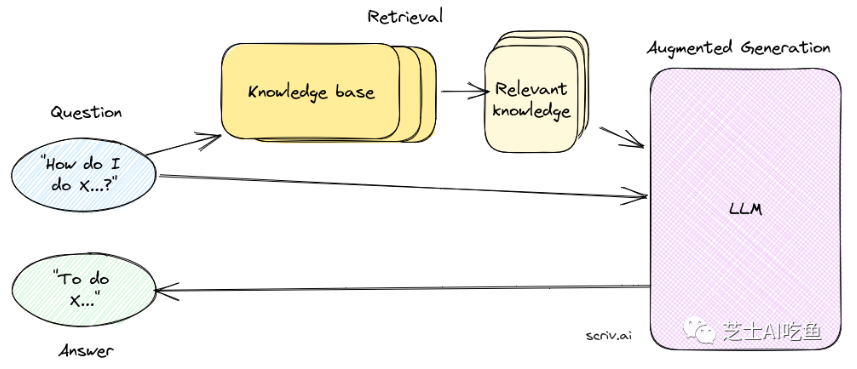
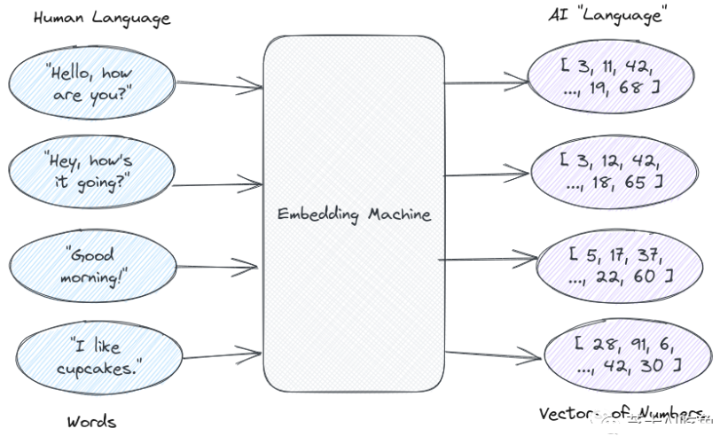
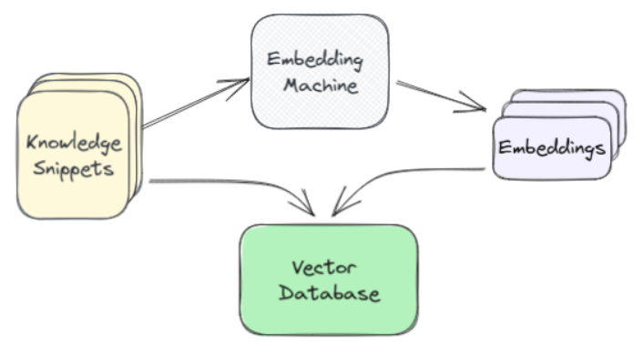
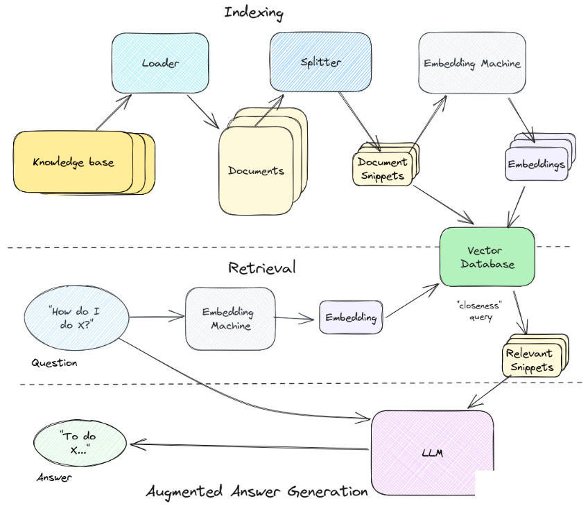

# 12 RAG(Retrieval Augmented Generation)技术

## 目录

-   [1.什么是检索增强生成](#1什么是检索增强生成)
-   [2.从知识库中获取正确的信息](#2从知识库中获取正确的信息)
-   [3.嵌入](#3嵌入)
-   [4.索引数据库](#4索引数据库)
-   [5.总结](#5总结)

看到一篇好文，这里重新对检索语言生成做一个系统的整理。

## 1.什么是检索增强生成

**检索增强生成是用从其他地方检索到的附加信息来补充用户输入到大型语言模型 (LLM)（例如 ChatGPT）的过程**。然后，LLM可以使用该信息来增强其生成的响应。

下图展示了检索语言生成的工作原理：

首先发生的是检索步骤。这是接受用户问题并从知识库中搜索可能回答该问题的最相关内容的过程。检索步骤是迄今为止 RAG 链中最重要、最复杂的部分。

在这里，我们不能只为LLM提供整个知识库。原因如下：首先模型对一次可以读取的文本长度有限制；其次发送大量文本会变得相当昂贵。

所以怎么从数据库中获取正确的信息非常重要。

## 2.从知识库中获取正确的信息

检索是一种搜索操作——我们希望根据用户的输入查找最相关的信息。就像搜索一样，有两个主要部分：

1.  **索引**：将知识库变成可以搜索/查询的内容。
2.  **查询**：从搜索词中提取最相关的知识。

值得注意的是，任何搜索过程都可以用于检索。任何接受用户输入并返回一些结果的方法都是ok的。因此，举例来说，可以尝试查找与用户问题相匹配的文本并将其发送给LLM，或者可以通过 Google 搜索该问题并将最热门的结果发送出去。

也就是说，当今大多数RAG 系统都依赖于一种称为语义搜索的技术，它使用人工智能技术的另一个核心部分：嵌入。

## 3.嵌入

在LLM的世界中，任何人类语言都可以表示为**数字向量**（列表）。这个数字向量就是**嵌入**。

LLM 技术的一个关键部分是从人类文字语言到人工智能数字语言的翻译器，这个翻译器被称为“词嵌入”。

在索引方面，首先必须将知识库分解为文本块。完成此操作后，将每个知识片段通过embedding模型传递，并返回该文本的嵌入表示。然后，保存该片段以及向量数据库中的嵌入——该数据库针对数字向量进行了优化。

这个向量数据库就嵌入了知识库的所有内容。从概念上讲，也可以将其视为整个知识库在“语言”图上的图，一旦有了这个图，就可以通过输入的嵌入在向量数据库中找到最接近的片段，这些是与所提出的问题最相关的增强答案，也就是我们提取发送给LLM的片段！

## 4.索引数据库

索引知识库通常是整个事情中最困难和最重要的部分。

分割文档也是一门艺术，也就是整个流程中最困难最重要的部分，包括平均片段的大小（太大，它们不能很好地匹配查询，太小，它们没有足够的有用上下文来生成答案），如何拆分内容（通常按标题，如果有的话）。

索引过程可归结为两个高级步骤。

1.  加载Loading：从通常存储的位置获取知识库的内容。
2.  分割Splitting：将知识分割成适合嵌入搜索的片段大小的块。

## 5.总结

整个RAG pipeline如下：

首先，索引我们的知识库。我们获取知识并使用加载器将其转换为单独的文档，然后使用拆分器将其转换为一口大小的块或片段。一旦我们有了这些，我们就把它们传递给嵌入模型，嵌入模型将它们转换成可用于语义搜索的向量。我们将这些嵌入及其文本片段保存在我们的矢量数据库中。

接下来是检索。它从问题开始，然后通过同一嵌入模型发送并传递到我们的矢量数据库以确定最接近的匹配片段，我们将用它来回答问题。

最后，增强答案生成。我们获取知识片段，将它们与自定义系统提示和我们的问题一起格式化，最后得到特定于上下文的答案。

附上一个感觉整理不错的RAG博客[https://zhuanlan.zhihu.com/p/661465330](https://zhuanlan.zhihu.com/p/661465330 "https://zhuanlan.zhihu.com/p/661465330")。
